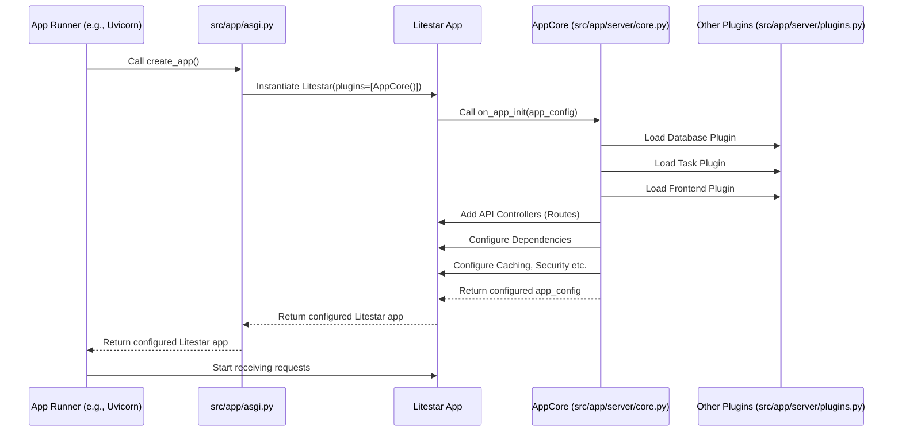

# Chapter 1: Litestar Application Core

Welcome to the `litestar-fullstack` tutorial! We're going to build a complete web application, from the backend logic to the buttons you click in your browser. But before we can build the different rooms and features of our digital house, we need to lay the foundation and put up the main frame. That's what this chapter is about: the **Litestar Application Core**.

## What is the Application Core?

Imagine building a car. You need a central piece – the **chassis** – that holds everything together: the engine, the wheels, the steering, the seats, the electronics. Without this core structure, you just have a pile of parts.

In our web application, the **Litestar Application Core** is like that chassis and engine combined. It's the heart of our backend (the server-side part of our application) built using the [Litestar framework](https://litestar.dev/).

Its main job is to **wire everything together**:

1.  **Routing:** When you visit a web address like `/users` or `/products/1`, how does the application know which piece of Python code should handle that request? The Application Core sets up this mapping, like a receptionist directing visitors to the right office. We'll dive deeper into this in [Chapter 3: API Controllers](03_api_controllers_.md).
2.  **Plugins:** Need extra superpowers like talking to a database, running tasks in the background, or integrating with the frontend build process? Plugins add these features. The Application Core ensures these plugins are loaded and ready. We'll see specific plugins in chapters like [Chapter 5: Database Models & Services (SQLAlchemy)](05_database_models___services__sqlalchemy__.md) and [Chapter 8: Background Tasks (SAQ)](08_background_tasks__saq__.md).
3.  **Middleware:** Sometimes, you want to process *every* web request in a standard way before it reaches its specific handler (or after it leaves). For example, logging the request or checking if a user is logged in. Middleware does this, and the Application Core puts it in place.
4.  **Dependencies:** Often, different parts of your code need access to the same resource, like a database connection or user session information. The Application Core manages how these shared resources (dependencies) are provided. We'll touch on this more in [Chapter 6: Authentication & Authorization (Guards)](06_authentication___authorization__guards__.md).
5.  **Configuration:** How does the application know the database password or whether it's running in development mode? The Application Core helps load and apply [Application Configuration (Settings)](02_application_configuration__settings__.md).

Essentially, the Application Core takes all the separate pieces of our backend and integrates them into a single, functioning Litestar application.

## How is the Application Core Used?

In the `litestar-fullstack` project structure, you don't usually interact *directly* with the Application Core daily. It's set up once to establish the application's structure. The main place you see it being used is when the application itself is created.

Let's look at the entry point file, `src/app/asgi.py`:

```python
# File: src/app/asgi.py
from __future__ import annotations

from typing import TYPE_CHECKING

if TYPE_CHECKING:
    from litestar import Litestar

# This function creates our main web application object
def create_app() -> Litestar:
    """Create ASGI application."""

    from litestar import Litestar

    # Here we import our Application Core
    from app.server.core import ApplicationCore

    # We create the Litestar app and pass ApplicationCore as a plugin!
    # This tells Litestar to use our core setup logic.
    return Litestar(plugins=[ApplicationCore()])

```

*   **Explanation:** This `create_app` function builds the main Litestar application object. The crucial line is `Litestar(plugins=[ApplicationCore()])`. It tells Litestar: "When you start up, use the setup logic defined in the `ApplicationCore` class." The `ApplicationCore` itself is implemented as a Litestar `Plugin`, a standard way to hook into Litestar's initialization process.

## Under the Hood: How the Core Initializes the App

So, what actually happens when `ApplicationCore()` is passed to `Litestar`?

1.  **Startup:** When you run the application (we'll see how in [Chapter 10: Development & CLI Tools](10_development___cli_tools__makefile__pre_commit__cli_commands__.md)), the `create_app` function is called.
2.  **Litestar Instantiation:** The `Litestar(...)` call begins creating the application object.
3.  **Plugin Hook:** Litestar sees the `ApplicationCore` plugin in the `plugins` list. Because `ApplicationCore` uses Litestar's `InitPluginProtocol`, Litestar knows to call its `on_app_init` method.
4.  **Core Setup (`on_app_init`):** The `on_app_init` method inside `ApplicationCore` (in `src/app/server/core.py`) runs. This is where the magic happens:
    *   It reads [Application Configuration (Settings)](02_application_configuration__settings__.md).
    *   It configures documentation (OpenAPI/Swagger/Scalar).
    *   It adds *other* necessary plugins (like database handling with SQLAlchemy, background tasks with SAQ, frontend integration with Vite). These helper plugins are often defined in `src/app/server/plugins.py`.
    *   It registers all the different web page handlers ([API Controllers](03_api_controllers_.md)).
    *   It sets up shared resources (Dependencies) like database sessions.
    *   It configures caching, security rules ([Authentication & Authorization (Guards)](06_authentication___authorization__guards__.md)), and more.
5.  **Ready:** Once `on_app_init` finishes, the Litestar app object is fully configured and ready to receive web requests.

Here's a simplified diagram of this startup flow:



Let's peek at a small part of the `ApplicationCore` class itself in `src/app/server/core.py`:

```python
# File: src/app/server/core.py

# ... imports ...
from litestar.plugins import InitPluginProtocol # Allows hooking into app startup
# ... other imports ...

# Our Application Core inherits from Litestar's plugin protocols
class ApplicationCore(InitPluginProtocol, CLIPluginProtocol):
    # ... other setup like __slots__ ...

    # This method is automatically called by Litestar during startup
    def on_app_init(self, app_config: AppConfig) -> AppConfig:
        """Configure application during initialization."""

        from app.config import get_settings
        from app.server import plugins # Our collection of helper plugins
        # ... other imports needed for setup ...

        settings = get_settings() # Load application settings

        # --- Example 1: Adding other essential plugins ---
        # These add features like database, background tasks, etc.
        app_config.plugins.extend(
            [
                plugins.structlog, # For logging
                plugins.alchemy,   # For database [Chapter 5]
                plugins.vite,      # For frontend [Chapter 7]
                plugins.saq,       # For background tasks [Chapter 8]
                # ... and others ...
            ],
        )

        # --- Example 2: Adding API Controllers (Routes) ---
        # These classes define our actual web pages/API endpoints
        app_config.route_handlers.extend(
            [
                SystemController,    # e.g., for health checks
                AccessController,  # e.g., for login/register
                UserController,    # e.g., for user profiles
                # ... other controllers ... [Chapter 3]
            ],
        )

        # --- Example 3: Setting up Dependencies ---
        # Making 'current_user' available to request handlers
        dependencies = {"current_user": Provide(provide_user)}
        app_config.dependencies.update(dependencies) # [Chapter 6]

        # ... many other configurations happen here ...

        # Finally, return the fully configured AppConfig
        return app_config

    # ... other helper methods like for caching ...

```

*   **Explanation:**
    *   The class `ApplicationCore` implements `InitPluginProtocol`, signaling to Litestar it has an `on_app_init` method for setup.
    *   Inside `on_app_init`, it takes the initial `app_config` (application configuration) object and modifies it.
    *   It adds crucial plugins from `app.server.plugins` (Example 1). Think of these like installing expansion cards into a computer motherboard.
    *   It registers `Controller` classes (Example 2). Each controller defines a set of related web routes (like `/users`, `/users/{id}`). This populates the application's "address book".
    *   It sets up dependencies (Example 3), making things like the current logged-in user easily accessible in other parts of the code.
    *   After performing all setup steps, it returns the modified `app_config`.

You don't need to memorize all the details inside `on_app_init` right now. The key takeaway is that `ApplicationCore` acts as the central organizer during the application's startup phase, bringing together all the different components defined throughout the project.

## Conclusion

We've seen that the Litestar Application Core (`ApplicationCore` in our project) is the foundational piece that turns a collection of Python files and configurations into a coherent, running web application. It wires up routes, plugins, middleware, and dependencies, acting like the central chassis and engine. While much of its setup is handled by the `litestar-fullstack` template, understanding its role is key to knowing how the application starts and where different components are integrated.

In the next chapter, we'll look closer at one of the things the Application Core uses heavily: configuration files that tell our app *how* to behave.

Next up: [Chapter 2: Application Configuration (Settings)](02_application_configuration__settings__.md)

---

Generated by [AI Codebase Knowledge Builder](https://github.com/The-Pocket/Tutorial-Codebase-Knowledge)