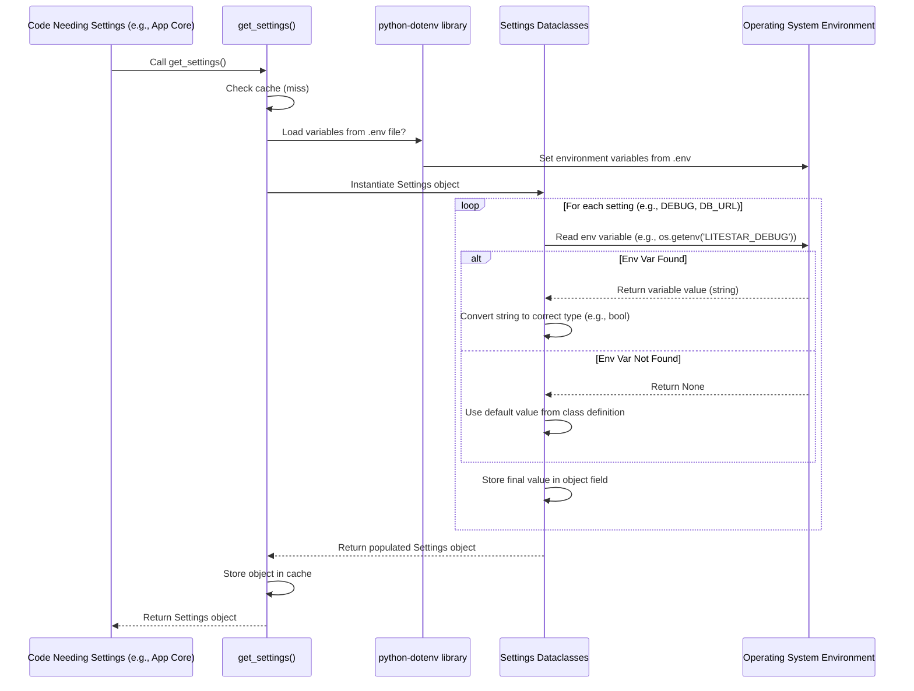

# Chapter 2: Application Configuration (Settings)

In the [previous chapter](01_litestar_application_core_.md), we learned about the **Litestar Application Core**, the central chassis that holds our application together. We saw that one of its jobs during startup is to load and apply **Configuration**. But what *is* configuration, and why do we need it? Let's dive in!

## Why Do We Need Settings?

Imagine you're building a website that needs to talk to a database. When you're working on your own computer (your "development" environment), you might use a simple test database with a password like `password123`. But when you put your website online for everyone to use (your "production" environment), you'll want to use a real, powerful database with a very strong, secret password.

How does your application know *which* database and *which* password to use? You don't want to write the password directly into your main code – that's insecure and inflexible!

This is where **Application Configuration (Settings)** comes in. It's a way to manage all the values your application needs that might change depending on *where* or *how* it's running.

## What is Application Configuration?

Think of Application Configuration as your app's **main control panel** or **settings menu**. It's a central place where you define details like:

*   **Database:** How to connect to the database (address, username, password).
*   **Secret Keys:** Random, secret values used for security features (like signing cookies).
*   **External Services:** API keys or URLs for other websites or tools your app uses (like sending emails or processing payments).
*   **Behavior Switches:** Simple flags to turn features on or off (e.g., `DEBUG_MODE = true` for development, `DEBUG_MODE = false` for production).
*   **Logging:** How much detail should be recorded in the application's logs.

By keeping all these settings together, we make it easy to:

1.  **Change behavior:** Switch from a test database to a production database without changing the core application code.
2.  **Keep secrets safe:** Store sensitive information like passwords outside of the main codebase.
3.  **Manage different environments:** Have one set of settings for development, another for testing, and another for the live production website.

## How Configuration Works in `litestar-fullstack`

Our project uses a common and powerful approach for handling settings:

1.  **Environment Variables & `.env` Files:** Settings often come from the system's "environment variables" (system-level settings) or special files named `.env`. The `.env` file in the main project folder is great for storing your *local development* settings, like your test database password. It's usually *not* saved in version control (like Git) to keep secrets safe. For production, settings are typically set directly as environment variables on the server.

2.  **Python Dataclasses:** Instead of just having loose variables, the project organizes settings into structured Python classes called `dataclasses`. This makes the code cleaner, helps catch errors (like typos in setting names), and makes it obvious what settings are available.

3.  **Central Loading Function:** A helper function reads the `.env` file and environment variables when the app starts and automatically fills in the values in our settings dataclasses.

Let's look at the key pieces:

**1. The `.env` file (Example - in your project root):**

```dotenv
# File: .env (Example - DO NOT commit real secrets!)

# App Settings
SECRET_KEY=a_super_secret_key_for_development_only # Change this!
LITESTAR_DEBUG=True

# Database Settings
DATABASE_URL=sqlite+aiosqlite:///db.sqlite3 # Use a simple file database for dev
DATABASE_ECHO=False

# Add other development settings here...
```

*   **Explanation:** This simple text file defines key-value pairs. When you run the app locally, it will read this file. `LITESTAR_DEBUG=True` tells the app to run in a mode helpful for development (like showing more detailed error messages).

**2. Settings Classes (Simplified View):**

Imagine simplified Python classes that *represent* these settings:

```python
# Simplified concept from src/app/config/base.py

from dataclasses import dataclass

@dataclass
class AppSettings:
    DEBUG: bool = False # Default value is False
    SECRET_KEY: str = "default_secret" # A default

@dataclass
class DatabaseSettings:
    URL: str = "default_db_url" # Default database location
    ECHO: bool = False # Default: don't log all SQL

@dataclass
class Settings:
    # This class holds all the other setting groups
    app: AppSettings = AppSettings()
    db: DatabaseSettings = DatabaseSettings()
    # ... other groups like ServerSettings, LogSettings ...
```

*   **Explanation:** We define classes like `AppSettings` and `DatabaseSettings` to hold related settings. The main `Settings` class brings them all together. Each setting has a type (like `bool` for true/false, `str` for text) and often a default value.

**3. The Loading Function:**

There's a function that does the magic of reading `.env` and environment variables to populate these classes.

```python
# Simplified concept from src/app/config/base.py
import os # For reading environment variables
from functools import lru_cache # For efficiency

# (Code to load .env file happens here)

@lru_cache() # Optimization: only load settings once
def get_settings() -> Settings:
    """Loads settings from environment and .env file."""
    print("Loading application settings...") # You might see this on startup
    # Create instances of our settings classes
    app_settings = AppSettings(
        # Read 'LITESTAR_DEBUG' env var, default to False if not found
        DEBUG=os.getenv("LITESTAR_DEBUG", "False").lower() == "true",
        SECRET_KEY=os.getenv("SECRET_KEY", "default_secret"),
    )
    db_settings = DatabaseSettings(
        URL=os.getenv("DATABASE_URL", "default_db_url"),
        ECHO=os.getenv("DATABASE_ECHO", "False").lower() == "true",
    )
    # ... load other settings ...

    # Return the main object containing all settings
    return Settings(app=app_settings, db=db_settings)
```

*   **Explanation:** The `get_settings()` function is called when the application starts. It reads environment variables (using `os.getenv`) corresponding to the fields in our dataclasses. If an environment variable isn't found, it uses the default value defined in the class. It returns a single `Settings` object containing all the loaded configuration values. The `@lru_cache()` part is a performance trick to ensure settings are only loaded once.

## Using the Configuration

Once loaded, how do other parts of the application use these settings? Often, the [Litestar Application Core](01_litestar_application_core_.md) uses the settings during its setup process.

For example, look at how the database configuration is prepared for Litestar:

```python
# File: src/app/config/app.py (Simplified)

from .base import get_settings # Import our loading function

# 1. Load all application settings
settings = get_settings()

# 2. Use the loaded settings to configure specific parts
# Example: Configure the database plugin
alchemy_config = SQLAlchemyAsyncConfig( # Database plugin config object
    # Get the DB URL from the loaded settings
    engine_instance=settings.db.get_engine(),
    # ... other database options using `settings.db` ...
)

# Example: Configure Cross-Origin Resource Sharing (CORS)
cors_config = CORSConfig(
    # Get allowed origins from the loaded settings
    allow_origins=settings.app.ALLOWED_CORS_ORIGINS
)
```

*   **Explanation:**
    1.  The code first calls `get_settings()` to get the fully loaded `Settings` object.
    2.  It then accesses specific parts of the settings using dot notation, like `settings.db.URL` or `settings.app.ALLOWED_CORS_ORIGINS`.
    3.  These values are used to configure various Litestar plugins and features (like the database (`alchemy_config`) or security settings (`cors_config`)).

You generally **don't** need to call `get_settings()` everywhere in your code. The configuration is usually accessed once during startup, and the results are used to set up components (like database connections or API clients) which are then made available to the rest of your application through Litestar's dependency injection system (which we'll see more of later).

## How Loading Works: Under the Hood

Let's trace the steps when the application needs its settings:

1.  **First Request:** Somewhere during application startup (often within the [Application Core's](01_litestar_application_core_.md) `on_app_init` method), the `get_settings()` function is called for the first time.
2.  **Cache Check:** The `@lru_cache` decorator checks if it has already loaded the settings. Since it's the first time, it hasn't.
3.  **`.env` Load:** Code inside `Settings.from_env()` (called by `get_settings()`) looks for a `.env` file in the project directory. If found, it loads the key-value pairs from it into the environment (using the `python-dotenv` library). This happens *before* reading individual variables, so `.env` values are available.
4.  **Environment Read & Dataclass Population:** For each setting field defined in the `Settings`, `AppSettings`, `DatabaseSettings`, etc., the code attempts to read a corresponding environment variable (e.g., reading `DATABASE_URL` for `DatabaseSettings.URL`).
5.  **Type Conversion & Defaults:** If an environment variable is found, its string value is converted to the correct type (e.g., `"True"` becomes `True`, `"8000"` becomes `8000`). If an environment variable is *not* found, the default value specified in the dataclass definition is used.
6.  **Object Creation:** Instances of `AppSettings`, `DatabaseSettings`, etc., are created with these values.
7.  **Main Settings Object:** The main `Settings` object is created, holding all the sub-setting objects (like `settings.app`, `settings.db`).
8.  **Caching:** The `@lru_cache` decorator saves this fully populated `Settings` object.
9.  **Return:** The `Settings` object is returned to the caller.
10. **Subsequent Requests:** If `get_settings()` is called again later, the `@lru_cache` decorator immediately returns the saved object from step 8 without reloading everything.

Here's a simplified diagram of that flow:



## Conclusion

Application Configuration is like the control panel for your application. It allows you to separate *how* your application runs (database details, secret keys, debug modes) from the core logic itself. `litestar-fullstack` uses a standard approach with `.env` files, environment variables, and Python dataclasses, all accessed through the `get_settings()` function during startup. This makes it easy to manage different settings for development and production environments without changing your application code.

Now that we understand how the application gets its basic instructions and wiring, let's look at how we define the actual web pages or API endpoints that users interact with.

Next up: [Chapter 3: API Controllers](03_api_controllers_.md)

---

Generated by [AI Codebase Knowledge Builder](https://github.com/The-Pocket/Tutorial-Codebase-Knowledge)