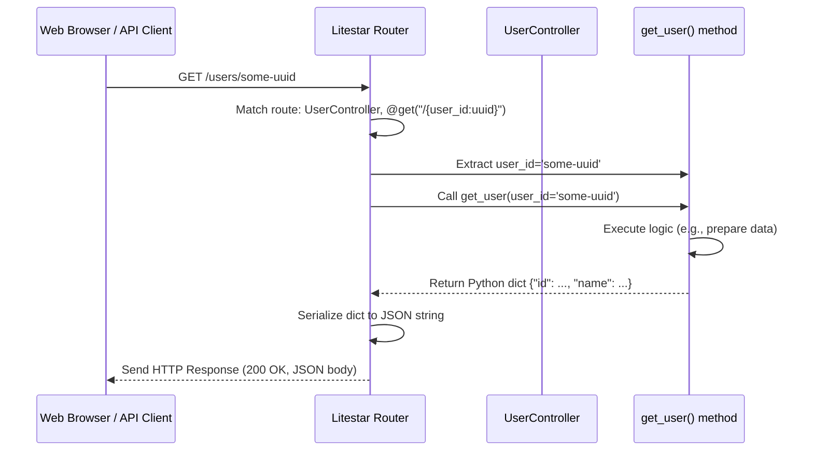

# Chapter 3: API Controllers

In the [previous chapter](02_application_configuration__settings__.md), we saw how our Litestar application loads its settings and configuration, like knowing which database to connect to or what secret keys to use. Now that the application knows *how* to operate, we need to define *what* it actually does when someone visits a specific web address (URL).

Imagine you walk into a large company headquarters. You need to talk to someone in the Sales department to buy a product, or maybe visit Human Resources (HR) to ask about a job. How do you know where to go? There's usually a directory or a receptionist who directs you to the correct office based on what you need.

In our web application, **API Controllers** are like those specific departments (Sales, HR, Support), and Litestar acts like the receptionist, directing incoming web requests to the right place.

## What Problem Do Controllers Solve?

When a user's browser (or another application) sends a request to our backend server, like asking for `GET /users` to get a list of users, or `POST /users` to create a new user, how does our application know which piece of Python code should handle that specific request?

This is the job of API Controllers and their associated "route handlers". They define the map between:

*   A **URL path** (like `/users`, `/products/123`, `/settings`)
*   An **HTTP method** (like `GET`, `POST`, `PATCH`, `DELETE`)
*   A specific **Python function or method** that should run.

Essentially, controllers organize the different "services" or "endpoints" our backend offers to the outside world.

## Core Concepts of API Controllers

1.  **Controller Class:** This is a Python class that inherits from Litestar's `Controller`. It acts as a container to group related functionality. For example, a `UserController` might handle everything related to users (listing, creating, updating, deleting). A `TeamController` would handle team-related actions. This keeps our code organized. Think of it as the "Sales Department" office.

2.  **Route Handler:** This is a method (a function inside the Controller class) that performs the actual work for a specific request. For example, a `list_users` method inside `UserController` would contain the logic to fetch all users. A `create_user` method would handle adding a new user. This is like a specific procedure within the Sales Department, like "Process New Order".

3.  **HTTP Method Decorators (`@get`, `@post`, etc.):** These are special Python markers (decorators) placed *above* the route handler method. They tell Litestar two crucial things:
    *   Which HTTP method this handler responds to (`GET`, `POST`, `PATCH`, `DELETE`, etc.).
    *   Which URL path this handler is responsible for (relative to the controller's base path, if any).

## Example: A Simple User Controller

Let's build a very basic controller to handle requests related to users.

**Use Case:** We want to define two simple endpoints:
*   `GET /users`: To get a (currently fake) list of users.
*   `GET /users/{user_id}`: To get details about a specific user (again, fake for now).

Here's how we might define the controller in Python using Litestar:

```python
# File: src/app/domain/accounts/controllers/users.py (Simplified Example)

from litestar import Controller, get # Import Controller and the @get decorator
from uuid import UUID # For handling unique identifiers

# Define our controller class, inheriting from Litestar's Controller
class UserController(Controller):
    path = "/users" # Base path for all handlers in this controller

    # Route handler for GET requests to the base path ("/users")
    @get()
    async def list_users(self) -> list[dict]:
        """Handles GET /users requests."""
        print("Request received for listing users!")
        # In a real app, we'd fetch this from the database.
        # We'll learn how in Chapter 5.
        return [{"id": "fake-id-1", "name": "Alice"}, {"id": "fake-id-2", "name": "Bob"}]

    # Route handler for GET requests with an ID ("/users/{user_id}")
    # The {user_id:uuid} part tells Litestar to expect a UUID here
    # and pass it to the method as the 'user_id' argument.
    @get("/{user_id:uuid}")
    async def get_user(self, user_id: UUID) -> dict:
        """Handles GET /users/{user_id} requests."""
        print(f"Request received for user ID: {user_id}")
        # Again, normally we'd fetch this specific user from the database.
        return {"id": str(user_id), "name": "Specific User", "email": "user@example.com"}

# --- How this controller gets added to the app ---
# In src/app/server/core.py, during app setup:
#
# from app.domain.accounts.controllers import UserController # Import it
#
# class ApplicationCore(...):
#     def on_app_init(self, app_config: AppConfig) -> AppConfig:
#         # ... other setup ...
#         app_config.route_handlers.append(UserController) # Register the controller
#         # ... other setup ...
#         return app_config
```

*   **Explanation:**
    *   We create a `UserController` that inherits from `litestar.Controller`.
    *   `path = "/users"` sets the base URL for all routes defined within this controller.
    *   The `list_users` method is decorated with `@get()`. Because the decorator path is empty, it attaches to the controller's base path (`/users`). When someone sends a `GET` request to `/users`, this method will run.
    *   The `get_user` method is decorated with `@get("/{user_id:uuid}")`. This combines with the controller's base path to match `GET /users/{some-uuid-value}`. The `{user_id:uuid}` part automatically captures the value from the URL and passes it as the `user_id` argument to the method.
    *   The `-> list[dict]` and `-> dict` are type hints, telling us (and Litestar) what kind of data the methods are expected to return. Litestar automatically converts Python dictionaries and lists into JSON responses for APIs.
    *   Finally, the controller needs to be registered with the main application, usually in the [Litestar Application Core](01_litestar_application_core_.md) setup (`on_app_init`), so Litestar knows it exists.

## Handling Other Methods (e.g., POST)

Controllers aren't just for getting information (`GET`). They also handle creating (`POST`), updating (`PATCH` or `PUT`), and deleting (`DELETE`) resources.

Let's add a (simplified) handler to create a new user:

```python
# File: src/app/domain/accounts/controllers/users.py (Adding POST)

from litestar import Controller, get, post # Import the @post decorator
from uuid import UUID, uuid4

# We'll need a way to describe the expected input data
# This is covered in Chapter 4: Data Schemas & DTOs
from pydantic import BaseModel

class UserCreateData(BaseModel):
    name: str
    email: str

class UserController(Controller):
    path = "/users"

    @get()
    async def list_users(self) -> list[dict]:
        # ... (same as before) ...
        return [{"id": "fake-id-1", "name": "Alice"}, {"id": "fake-id-2", "name": "Bob"}]

    @get("/{user_id:uuid}")
    async def get_user(self, user_id: UUID) -> dict:
        # ... (same as before) ...
        return {"id": str(user_id), "name": "Specific User", "email": "user@example.com"}

    # Route handler for POST requests to the base path ("/users")
    @post()
    async def create_user(self, data: UserCreateData) -> dict:
        """Handles POST /users requests to create a new user."""
        # 'data' will contain the parsed JSON body sent by the client,
        # automatically validated against our UserCreateData schema.
        print(f"Received data to create user: {data.name}, {data.email}")
        # Normally, we'd save this to the database.
        new_user_id = uuid4()
        return {"id": str(new_user_id), "name": data.name, "email": data.email, "status": "created"}
```

*   **Explanation:**
    *   We added `@post()` above the `create_user` method. This links it to `POST /users`.
    *   The `data: UserCreateData` parameter is key. Litestar, with the help of Pydantic (which we'll discuss in [Chapter 4: Data Schemas & DTOs](04_data_schemas___dtos__.md)), automatically takes the JSON data sent in the request body, validates it matches the structure of `UserCreateData`, and provides it as a ready-to-use Python object (`data`).
    *   The method then simulates creating the user and returns a dictionary representing the newly created user, which Litestar converts to JSON.

## How Controllers Work (Under the Hood)

What happens when a request like `GET /users/some-uuid` hits our application?

1.  **Request Arrives:** Your browser or API client sends the HTTP request to the server running the Litestar application.
2.  **Litestar Routing:** Litestar receives the request. It looks at the **HTTP method** (`GET`) and the **URL path** (`/users/some-uuid`).
3.  **Route Matching:** Litestar checks its internal "routing table" (which was built during startup when controllers were registered by the [Litestar Application Core](01_litestar_application_core_.md)). It finds a match: the `@get("/{user_id:uuid}")` decorator inside the `UserController` (which has a base path of `/users`).
4.  **Path Parameter Extraction:** Litestar extracts the `some-uuid` part from the URL path because it matches the `{user_id:uuid}` pattern. It validates that it's a valid UUID.
5.  **Dependency Resolution (If any):** If the handler method requires dependencies (like a database session or the current user), Litestar prepares them. (We'll see this more in [Chapter 5](05_database_models___services__sqlalchemy__.md) and [Chapter 6](06_authentication___authorization__guards__.md)).
6.  **Handler Execution:** Litestar calls the `get_user` method, passing the extracted `user_id` value as an argument.
7.  **Logic Runs:** The Python code inside `get_user` executes. In our example, it just creates a dictionary. In a real app, it might query the database.
8.  **Response Generation:** The `get_user` method returns a Python dictionary.
9.  **Serialization:** Litestar automatically converts the Python dictionary into a JSON string.
10. **HTTP Response:** Litestar packages the JSON string into an HTTP response with the correct headers (e.g., `Content-Type: application/json`) and status code (usually `200 OK` for successful GET requests).
11. **Response Sent:** The HTTP response is sent back to the client.

Here's a simplified diagram of that flow:



## Structure in `litestar-fullstack`

In our project, controllers are typically located within the `src/app/domain/` directory, grouped by feature area. For example:

*   `src/app/domain/accounts/controllers/users.py`: For user management (`UserController`).
*   `src/app/domain/accounts/controllers/access.py`: For login/registration (`AccessController`).
*   `src/app/domain/teams/controllers/teams.py`: For team management (`TeamController`).
*   `src/app/domain/system/controllers.py`: For system-level checks (`SystemController`).
*   `src/app/domain/web/controllers.py`: For serving the main frontend page (`WebController`).

These controllers are then imported and registered in the `on_app_init` method of the `ApplicationCore` in `src/app/server/core.py`, making Litestar aware of all the available API endpoints.

```python
# File: src/app/server/core.py (Relevant Snippet)

# ... imports for controllers ...
from app.domain.accounts.controllers import AccessController, UserController
from app.domain.system import SystemController
from app.domain.teams.controllers import TeamController
from app.domain.web import WebController
# ... etc ...

class ApplicationCore(InitPluginProtocol, CLIPluginProtocol):
    # ...

    def on_app_init(self, app_config: AppConfig) -> AppConfig:
        # ... other configurations ...

        # Register all the API endpoint controllers
        app_config.route_handlers.extend(
            [
                AccessController, # Handles /login, /register, etc.
                UserController,   # Handles /users, /users/{id}, etc.
                TeamController,   # Handles /teams, /teams/{id}, etc.
                SystemController, # Handles /health
                WebController,    # Handles / (serves the frontend)
                # ... add other controllers here ...
            ],
        )

        # ... other configurations ...
        return app_config

```

## Conclusion

API Controllers are the backbone of our backend's API. They act like specific departments, organizing our code and defining the exact URLs and HTTP methods our application responds to. Using Controller classes and route handler methods with decorators like `@get` and `@post`, we create a clear map from incoming requests to the Python code that handles them. Litestar takes care of the routing, data extraction, and response generation, letting us focus on the logic within our handler methods.

So far, our handlers have dealt with fake data or very simple inputs. But real applications need to handle structured data coming in (like the user's name and email during registration) and often return complex data. How do we define and validate this data? That's the topic of our next chapter!

Next up: [Chapter 4: Data Schemas & DTOs](04_data_schemas___dtos__.md)

---

Generated by [AI Codebase Knowledge Builder](https://github.com/The-Pocket/Tutorial-Codebase-Knowledge)