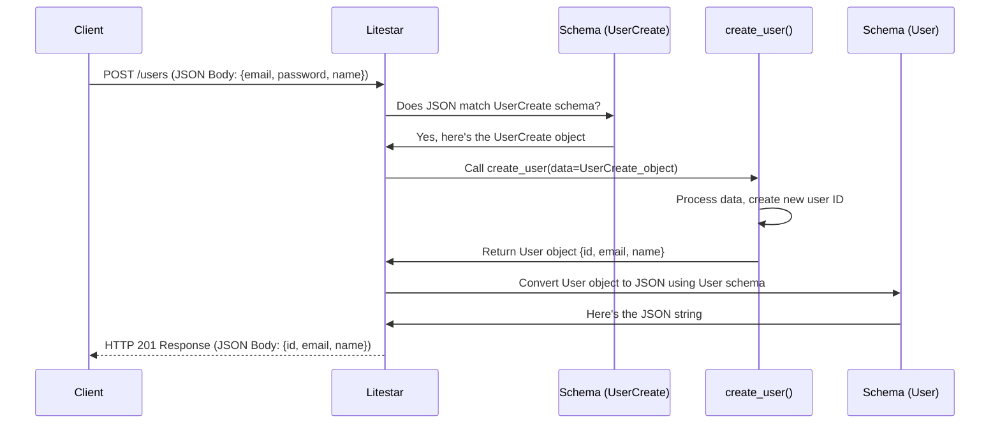

# Chapter 4: Data Schemas & DTOs

In the [previous chapter](03_api_controllers_.md), we learned how **API Controllers** act like departments in our application, routing incoming web requests (like `GET /users` or `POST /users`) to the correct Python functions (route handlers). We even saw a sneak peek of how a `POST /users` handler might receive data using `data: UserCreateData`.

But how does the application *know* what `UserCreateData` should look like? If the frontend sends `{ "user_email": "test@example.com", "pass": "secret123" }`, but our backend expects `{ "email": "test@example.com", "password": "secret123" }`, things will break!

This is where **Data Schemas** and **Data Transfer Objects (DTOs)** come in. They act like standardized forms or contracts, ensuring everyone sending or receiving information uses the same, expected format.

## Why Do We Need Standardized Data Formats?

Imagine ordering a custom sandwich. You fill out an order form: check boxes for bread type, fillings, sauces, etc. The sandwich maker uses this specific form to know exactly how to make your sandwich. If you just scribbled "A good sandwich, please!" on a napkin, they wouldn't know what you want, and you might get something unexpected.

In web applications:

*   **Frontend (Client):** Needs to send data to the backend (e.g., user registration details, updated profile information).
*   **Backend (Server):** Needs to understand the data received from the frontend, validate it, and often send structured data back (e.g., user details, list of products).

**Data Schemas & DTOs** solve these problems by defining the *exact structure* of the data being exchanged:

1.  **Consistency:** Ensures the frontend and backend agree on field names (is it `email` or `userEmail`?), data types (is `age` a number or text?), and which fields are required vs. optional.
2.  **Validation:** Automatically checks if incoming data matches the defined structure. If someone sends bad data (e.g., missing a required field, sending text where a number is expected), the schema rejects it *before* it reaches our main application logic.
3.  **Clarity & Documentation:** Makes the code easier to understand because the expected data format is clearly defined. Litestar can also use these schemas to automatically generate API documentation (like Swagger UI or Scalar), showing users exactly how to interact with the API.

## Core Concepts

Let's break down the key ideas:

### 1. Data Schema

*   **What it is:** A **blueprint** or **template** that defines the structure of your data. It specifies:
    *   The names of the data fields (e.g., `name`, `email`, `age`).
    *   The expected type for each field (e.g., `string`, `integer`, `boolean`, `list`).
    *   Which fields are required and which are optional.
    *   Sometimes, more complex validation rules (e.g., "email must be a valid email format", "age must be greater than 18").
*   **Analogy:** The official "New User Registration" form template. It clearly shows which boxes need to be filled (required fields) and what kind of information goes in each box (data types).
*   **In `litestar-fullstack`:** We often use Python libraries like `msgspec` or standard Python `dataclasses` to define these schemas. You saw `CamelizedBaseStruct` in the code snippets from the previous chapter - this is a base helper class for our schemas using `msgspec`.

### 2. Data Transfer Object (DTO)

*   **What it is:** An object specifically designed to **carry data** between different parts of your system, especially between the frontend and the backend API. DTOs are often defined using the Data Schemas mentioned above.
*   **Analogy:** A filled-out "New User Registration" form. It holds the *actual data* for one specific registration, following the structure defined by the form template (the schema).
*   **Relation to Database Models:** In [Chapter 5](05_database_models___services__sqlalchemy__.md), we'll discuss Database Models, which define how data is stored in the database. DTOs are often *similar* to database models but can be different:
    *   They might **exclude** sensitive fields (like password hashes) that shouldn't be sent to the frontend.
    *   They might **reshape** data for a specific API use case (e.g., combining fields or adding computed values).
    *   They might be used purely for **input validation** and never stored directly.
*   **In `litestar-fullstack`:** We use classes based on `msgspec.Struct` or `dataclasses.dataclass` for simple DTOs. For DTOs that closely mirror our database structures, we often use `advanced_alchemy.extensions.litestar.dto.SQLAlchemyDTO`, which helps automatically create DTOs from [SQLAlchemy Models](05_database_models___services__sqlalchemy__.md).

### 3. Validation

*   **What it is:** The process of checking if the actual data received matches the rules defined in the schema.
*   **How it works:** When Litestar receives an incoming request with data (like JSON in the request body), and the route handler specifies a schema/DTO for that data, Litestar automatically uses the schema to validate the incoming data *before* calling your handler function.
*   **Benefit:** Protects your application logic from unexpected or invalid data, catching errors early. If validation fails, Litestar typically sends back an automatic error response (like a `400 Bad Request` or `422 Unprocessable Entity`) indicating what was wrong.

### 4. Serialization & Deserialization

*   **Deserialization (Input):** Converting data from a wire format (like JSON sent by the frontend) into a structured Python object (our DTO instance) based on the schema. Litestar handles this for incoming requests.
    *   `JSON -> Python Object`
*   **Serialization (Output):** Converting a structured Python object (like the one returned by your route handler) into a wire format (like JSON) to send back to the frontend. Litestar also handles this for responses.
    *   `Python Object -> JSON`

## Example: Creating a User (Revisited)

Let's refine the `create_user` example from [Chapter 3](03_api_controllers_.md) using schemas.

**Goal:** The frontend needs to send an email and password to create a new user. The backend should validate this input and respond with the new user's ID and email.

**1. Define the Input Schema/DTO:**

We need a schema describing the data required to create a user.

```python
# File: src/app/domain/accounts/schemas.py (Simplified)
from app.lib.schema import CamelizedBaseStruct # Our base struct

class UserCreate(CamelizedBaseStruct):
    """Schema for data needed to create a new user."""
    email: str  # The user's email address (required string)
    password: str # The user's chosen password (required string)
    name: str | None = None # Optional user name (string or None)
```

*   **Explanation:**
    *   We define a class `UserCreate` inheriting from `CamelizedBaseStruct`.
    *   `email: str` means we expect a field named `email` containing text (a string). It's required.
    *   `password: str` means we expect a required `password` field containing text.
    *   `name: str | None = None` means we expect an optional `name` field. If provided, it must be text; if not provided, it defaults to `None`.
    *   The `CamelizedBaseStruct` also means that in the JSON exchanged with the frontend, these fields will typically be named `email`, `password`, and `name` (or converted to camelCase like `userName` if we used Python's snake_case, but here they match).

**2. Define the Output Schema/DTO:**

We need a schema describing the data we'll send back after creating the user.

```python
# File: src/app/domain/accounts/schemas.py (Simplified)
from uuid import UUID # For unique IDs
from app.lib.schema import CamelizedBaseStruct

class User(CamelizedBaseStruct):
    """Schema representing a user for API responses."""
    id: UUID # The unique ID of the user (required UUID)
    email: str # The user's email (required string)
    name: str | None = None # Optional user name

# ... (other schemas like UserCreate) ...
```

*   **Explanation:**
    *   We define a `User` class representing the data we want to *return*.
    *   It includes the `id` (which wasn't in the input) but omits the `password`. We *never* want to send passwords back!
    *   It includes `email` and the optional `name`.

**3. Use the Schemas in the Controller:**

Now, let's update the controller from Chapter 3 to use these schemas.

```python
# File: src/app/domain/accounts/controllers/users.py (Simplified)

from litestar import Controller, post
from uuid import UUID, uuid4

# Import our defined schemas
from app.domain.accounts.schemas import User, UserCreate

class UserController(Controller):
    path = "/users"
    # ... (other handlers like list_users, get_user omitted for brevity) ...

    @post( # Handles POST /users
        dto='UserCreateDTO',  # Tells Litestar which DTO to use for input data
        return_dto='UserDTO', # Tells Litestar which DTO to use for output data
        sync_to_thread=False # Standard practice for async handlers
    )
    async def create_user(self, data: UserCreate) -> User:
        """Handles POST /users to create a new user."""
        # 1. Validation & Deserialization (Done automatically by Litestar!)
        #    Litestar receives JSON, validates it using UserCreate schema,
        #    and gives us the 'data' object (an instance of UserCreate).
        #    If validation fails, this function isn't even called.

        print(f"Received data to create user: {data.email}") # name is optional

        # 2. Application Logic
        #    (Here we would normally save the user to the database)
        #    Let's simulate creating a user ID.
        new_user_id = uuid4()
        print(f"Simulating user creation with ID: {new_user_id}")

        # 3. Prepare Response Data
        #    Create a User object (matching our response schema).
        response_data = User(
            id=new_user_id,
            email=data.email,
            name=data.name # Pass along the name if provided
        )

        # 4. Return the response object
        #    Litestar will automatically serialize this 'User' object
        #    into JSON based on the User schema.
        return response_data
```

*   **Explanation:**
    *   We import `User` and `UserCreate`.
    *   The key part is the `data: UserCreate` type hint in the `create_user` function signature. This tells Litestar: "When a POST request comes to `/users`, expect the request body to contain JSON that matches the `UserCreate` schema. Validate it, and if it's okay, give me the data as a `UserCreate` object."
    *   The `-> User` return type hint tells Litestar: "The object this function returns should conform to the `User` schema. Please serialize it into JSON accordingly."
    *   Inside the function, we can directly access `data.email`, `data.password`, and `data.name`. Litestar has already done the hard work of parsing and validating.
    *   We create a `User` object to send back, making sure it matches the `User` schema (including the `id`, excluding the `password`).

## How Schemas Fit in `litestar-fullstack`

*   **Location:** Schemas and DTOs are typically defined within the feature domain, often in a `schemas.py` file (like `src/app/domain/accounts/schemas.py` or `src/app/domain/teams/schemas.py`). Base schema helpers might live in `src/app/lib/schema.py`. DTO helpers, especially those related to database interactions, are in `src/app/lib/dto.py`.
*   **Base Schemas:** The project uses `msgspec.Struct` via `src/app/lib/schema.py` for defining basic schemas. `CamelizedBaseStruct` is a common base class that automatically handles converting Python's `snake_case` field names to JSON's `camelCase` and back, a common convention in web APIs.
*   **Database-linked DTOs (`SQLAlchemyDTO`):** For data structures that closely match our [Database Models & Services (SQLAlchemy)](05_database_models___services__sqlalchemy__.md), the project uses `SQLAlchemyDTO` provided by the `advanced-alchemy` library (found in `src/app/lib/dto.py`). This is powerful because it can automatically generate DTOs from your database models, reducing boilerplate code. Look at `src/app/domain/tags/controllers.py` for an example:

    ```python
    # File: src/app/domain/tags/controllers.py (Snippet)
    from advanced_alchemy.extensions.litestar.dto import SQLAlchemyDTO
    from app.db import models as m
    from app.lib import dto # Our DTO helpers

    # DTO for returning Tag data (excludes certain fields)
    class TagDTO(SQLAlchemyDTO[m.Tag]):
        # Config excludes fields like 'created_at', 'updated_at'
        config = dto.config(max_nested_depth=0, exclude={"created_at", "updated_at", "teams"})

    # DTO for creating a Tag (excludes fields generated by the DB like 'id')
    class TagCreateDTO(SQLAlchemyDTO[m.Tag]):
        config = dto.config(max_nested_depth=0, exclude={"id", "created_at", "updated_at", "teams"})

    # DTO for updating a Tag (fields are partial/optional)
    class TagUpdateDTO(SQLAlchemyDTO[m.Tag]):
        config = dto.config(max_nested_depth=0, exclude={"id", "created_at", "updated_at", "teams"}, partial=True)
    ```

    *   **Explanation:** These DTO classes automatically derive their fields from the `m.Tag` database model (which we'll see in the next chapter). The `config` tells the DTO how to behave – which fields from the database model to `exclude`, or if fields should be `partial` (optional, useful for updates).

## Under the Hood: How Validation and Serialization Work

Let's trace the `POST /users` request flow focusing on the data handling:

1.  **Client Sends Request:** The frontend application sends an HTTP POST request to `/users` with a JSON body:
    ```json
    {
      "email": "beginner@example.com",
      "password": "very_secure_password",
      "name": "Newbie Coder"
    }
    ```
2.  **Litestar Routing:** Litestar receives the request and matches it to the `create_user` handler in `UserController`.
3.  **Schema Identification:** Litestar inspects the `create_user` function signature and sees the parameter `data: UserCreate`.
4.  **Deserialization & Validation:** Litestar takes the incoming JSON body and uses the `UserCreate` schema definition:
    *   Checks if `email` exists and is a string. (Yes)
    *   Checks if `password` exists and is a string. (Yes)
    *   Checks if `name` exists and is a string or null. (Yes, it's a string)
    *   It converts the JSON data into a Python `UserCreate` object: `UserCreate(email='beginner@example.com', password='very_secure_password', name='Newbie Coder')`.
    *   If any check failed (e.g., missing `email`, or `email` was a number), Litestar would stop here and send a `422 Unprocessable Entity` error response back to the client *without* calling `create_user`.
5.  **Handler Execution:** Litestar calls `create_user(data=<the UserCreate object>)`.
6.  **Logic Runs:** Our function code executes, generates a `new_user_id`, and creates the response `User` object: `User(id=UUID('...'), email='beginner@example.com', name='Newbie Coder')`.
7.  **Serialization:** Litestar sees that `create_user` returns the `User` object. It uses the `User` schema definition to convert this Python object back into JSON, ensuring only the fields defined in `User` (`id`, `email`, `name`) are included, and the password is *not*.
    ```json
    {
      "id": "...", // The generated UUID string
      "email": "beginner@example.com",
      "name": "Newbie Coder"
    }
    ```
8.  **Response Sent:** Litestar sends an HTTP response with status `201 Created` and the generated JSON body back to the client.

Here's a simplified diagram:



## Conclusion

Data Schemas and DTOs are essential guardrails for our application's data. They act like strict, clear forms that ensure data flowing between the frontend and backend (and even between internal components) is structured correctly, validated automatically, and easy to understand. By defining schemas (using tools like `msgspec` or `dataclasses`) and using them as DTOs in our API controllers, we make our application more robust, maintainable, and self-documenting. `litestar-fullstack` leverages these concepts heavily, using base structs and `SQLAlchemyDTO` to streamline the process.

Now that we understand how to define the shape of data for our API, where does that data actually live persistently? How do we store user information, team details, or tags in a database? That's what we'll cover next.

Next up: [Chapter 5: Database Models & Services (SQLAlchemy)](05_database_models___services__sqlalchemy__.md)

---

Generated by [AI Codebase Knowledge Builder](https://github.com/The-Pocket/Tutorial-Codebase-Knowledge)