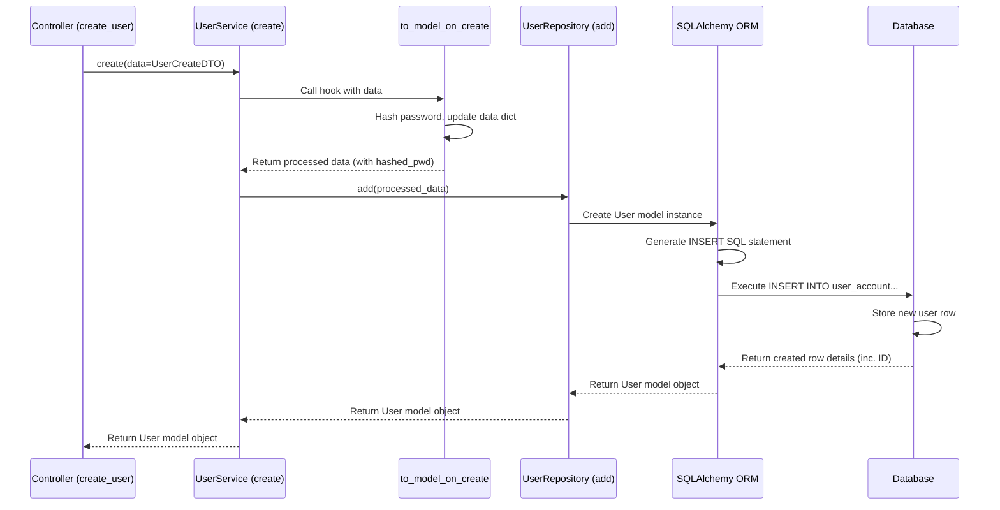

# Chapter 5: Database Models & Services (SQLAlchemy)

In [Chapter 4: Data Schemas & DTOs](04_data_schemas___dtos__.md), we learned how to define the *shape* of the data our application expects (like a `UserCreate` schema for new users) and sends back (like a `User` schema). But defining the shape isn't enough – where does this user data actually *go*? How do we store it so we can retrieve it later? How do we make sure a user's email is unique or hash their password before saving?

This is where our database interaction layer comes in, powered by SQLAlchemy. We need a way to talk to our database (like PostgreSQL or SQLite) to save, retrieve, update, and delete information persistently.

## Why Do We Need a Database Layer?

Imagine our `create_user` function from the previous chapter. It received user details, validated them, and sent back a response. But if the server restarted, that new user information would be gone forever! We need a place to **store the data permanently**, and that place is usually a database.

Interacting directly with databases using raw SQL commands (`INSERT INTO users...`, `SELECT * FROM users...`) can be repetitive, error-prone, and hard to manage as the application grows.

This chapter introduces the abstractions `litestar-fullstack` uses to make database interactions safer, easier, and more organized: **Models**, **Repositories**, and **Services**.

**Use Case:** Let's stick with our example: How do we take the validated `UserCreate` data from our API controller and actually save a new user record in the database, making sure the password is securely stored?

## Key Concepts: Models, Repositories, Services

Think of managing inventory in a warehouse. You need:

1.  **Blueprints:** Plans showing exactly what each storage shelf looks like, what it can hold, and its unique identifier (e.g., "Shelf Aisle 3, Bay 2").
2.  **Basic Tools:** Simple tools like a screwdriver or a hammer to assemble, modify, or access items on a specific shelf according to the blueprint.
3.  **Skilled Workers:** People who know the business rules (e.g., "never store food items next to chemicals," "log every item added"). They use the blueprints (to find the right shelf) and the tools (to interact with it) to manage the inventory correctly.

In our application:

### 1. Database Models (The Blueprints)

*   **What they are:** Python classes that define the structure of our database tables. Each class maps to a table, and attributes within the class map to columns in that table.
*   **Technology:** We use **SQLAlchemy ORM** (Object-Relational Mapper). This lets us work with database tables as if they were regular Python objects, hiding most of the raw SQL.
*   **Location:** Defined in `src/app/db/models/`. For example, `src/app/db/models/user.py` defines the `User` model.

Let's look at a simplified `User` model:

```python
# File: src/app/db/models/user.py (Simplified)

from advanced_alchemy.base import UUIDAuditBase # Base class with ID, created/updated times
from sqlalchemy import String
from sqlalchemy.orm import Mapped, mapped_column

class User(UUIDAuditBase): # Inherits common fields like ID
    __tablename__ = "user_account" # Name of the database table

    # Define columns for the 'user_account' table
    email: Mapped[str] = mapped_column(unique=True, index=True) # Email must be unique
    name: Mapped[str | None] = mapped_column(nullable=True) # Name is optional text
    hashed_password: Mapped[str | None] = mapped_column(String(length=255), nullable=True)
    is_active: Mapped[bool] = mapped_column(default=True) # Defaults to True

    # ... other fields and relationships ...
```

*   **Explanation:**
    *   The `User` class maps to the `user_account` table in the database.
    *   `UUIDAuditBase` provides standard columns like `id`, `created_at`, `updated_at`.
    *   `email: Mapped[str] = mapped_column(...)` defines an `email` column that must hold text (`str`) and must be unique across all users.
    *   SQLAlchemy uses these definitions to understand how user data should be stored and retrieved.

### 2. Repositories (The Basic Tools)

*   **What they are:** Classes that provide the fundamental **C**reate, **R**ead, **U**pdate, **D**elete (CRUD) operations directly tied to a specific database model. They know how to use the "blueprint" (Model) to perform basic tasks.
*   **Technology:** `litestar-fullstack` uses the `SQLAlchemyAsyncRepository` from the `advanced-alchemy` library. This library automatically provides sophisticated CRUD methods based on the model.
*   **How they're used:** You typically don't interact with Repositories *directly* in your controllers. They are used *inside* Services. `advanced-alchemy` makes this very convenient.

Think of a repository as having methods like `add(user_object)`, `get(user_id)`, `list()`, `update(user_object)`, `delete(user_id)`.

### 3. Services (The Skilled Workers)

*   **What they are:** Classes that contain the **business logic** related to a specific domain entity (like Users or Teams). They use Repositories (the tools) to interact with the database (Models/blueprints) but add extra steps or coordinate multiple actions based on application rules.
*   **Location:** Defined within the domain, often in `services.py` (e.g., `src/app/domain/accounts/services.py`).
*   **Role:**
    *   Called by [API Controllers](03_api_controllers_.md).
    *   Perform complex validation (beyond simple schema checks).
    *   Orchestrate operations (e.g., creating a user *and* sending a welcome email).
    *   Handle permissions or specific business rules (e.g., hashing a password *before* saving).
    *   Use the underlying Repository for basic database access.

Let's look at a simplified `UserService`:

```python
# File: src/app/domain/accounts/services.py (Simplified)

from advanced_alchemy.repository import SQLAlchemyAsyncRepository
from advanced_alchemy.service import SQLAlchemyAsyncRepositoryService, ModelDictT
from app.db import models as m # Import our database Models
from app.lib import crypt # Helper for password hashing

class UserService(SQLAlchemyAsyncRepositoryService[m.User]):
    """Handles database operations for users, including business logic."""

    # --- Repository Setup (Internal Tool) ---
    class UserRepository(SQLAlchemyAsyncRepository[m.User]):
        """Defines the basic toolset for the User model."""
        model_type = m.User # Connects the repository to the User model
    # Connect the service to its repository type
    repository_type = UserRepository

    # --- Business Logic Hooks ---
    async def to_model_on_create(self, data: ModelDictT[m.User]) -> ModelDictT[m.User]:
        """Executed *before* a new user is saved via the repository."""
        # 'data' might be a dictionary or DTO from the controller
        if isinstance(data, dict) and (password := data.get("password")):
            # Hash the password before it reaches the repository/database
            hashed_password = await crypt.get_password_hash(password)
            data = data.copy() # Avoid modifying the original input
            data["hashed_password"] = hashed_password
            del data["password"] # Remove the plain password

        # Pass the potentially modified data to the standard repository logic
        return await super().to_model(data)

    # ... other methods like authenticate(), update_password() ...
```

*   **Explanation:**
    *   `UserService` inherits from `SQLAlchemyAsyncRepositoryService`, which automatically wires it up with a `UserRepository` for basic CRUD.
    *   The `repository_type = UserRepository` line tells the service which "toolset" (Repository) to use.
    *   The `to_model_on_create` method is a special "hook" provided by the base service. It intercepts data *before* it's used to create a new database record.
    *   Inside this hook, we implement business logic: if a plain `password` is present in the input data, we hash it using our `crypt` helper and replace the plain password with the `hashed_password`.
    *   The `super().to_model(data)` ensures the rest of the standard creation process continues with the modified data.

**The Analogy Revisited:**
*   `User` class (Model) = Blueprint for the "user" storage shelf.
*   `UserRepository` (Repository) = Basic tools (add item, get item) for the "user" shelf.
*   `UserService` (Service) = The warehouse worker responsible for users. They know the rule: "Before adding a user item (calling `repository.add()`), make sure to securely package (hash) the password." They use the blueprint and tools correctly.

## Solving the Use Case: Saving a New User

Now let's see how the `create_user` controller, the `UserService`, and the `User` model work together.

**1. Controller Receives Request:**
Our `UserController` from [Chapter 3: API Controllers](03_api_controllers_.md) receives a `POST /users` request. Using [Chapter 4: Data Schemas & DTOs](04_data_schemas___dtos__.md), Litestar validates the incoming JSON against the `UserCreate` schema and gives the controller a `UserCreate` object (`data`).

**2. Controller Calls Service:**
The controller doesn't interact directly with the database. It delegates the task to the `UserService`. It needs access to an instance of the service. Litestar's dependency injection provides this automatically (configured in [Chapter 1: Litestar Application Core](01_litestar_application_core_.md)).

```python
# File: src/app/domain/accounts/controllers/users.py (Simplified POST handler)

from litestar import Controller, post
from litestar.di import Provide # For dependency injection

from app.domain.accounts.schemas import User, UserCreate
# Import the service!
from app.domain.accounts.services import UserService

# Define how to provide the UserService (dependency injection setup)
async def provide_user_service(db_session: AsyncSession) -> UserService:
    """This function creates the service instance when needed."""
    return UserService(session=db_session)

# Setup dependencies for the controller
dependencies = {"user_service": Provide(provide_user_service)}

class UserController(Controller):
    path = "/users"
    dependencies = dependencies # Make 'user_service' available

    @post(dto=UserCreateDTO, return_dto=UserDTO, sync_to_thread=False)
    async def create_user(
        self,
        data: UserCreate, # Input DTO from Chapter 4
        user_service: UserService # Service injected automatically!
    ) -> User: # Output DTO from Chapter 4
        """Handles POST /users to create a new user."""
        print(f"Controller received request to create user: {data.email}")

        # Delegate the creation task to the UserService
        created_user = await user_service.create(data=data) # Pass the input DTO

        print(f"Service created user with ID: {created_user.id}")

        # Return the created user data (will be serialized by Litestar)
        return created_user # This might implicitly use the UserDTO
```

*   **Explanation:**
    *   We import the `UserService` and set up dependency injection using `Provide`. Litestar automatically figures out how to create a `UserService` instance, providing it with a database `session` when needed.
    *   The `create_user` method now accepts `user_service: UserService` as a parameter. Litestar injects the service instance here.
    *   The core logic is now just `await user_service.create(data=data)`. All the database interaction and password hashing details are hidden within the service.

**3. Service Handles Business Logic & Calls Repository:**
The `user_service.create(data=data)` call triggers the following inside the `UserService`:
*   The `SQLAlchemyAsyncRepositoryService.create` method is called.
*   It invokes our custom `to_model_on_create` hook.
*   Our hook hashes the password and removes the plain text version from the `data`.
*   The base service method continues, calling the underlying `repository.add()` method with the processed data (now containing `hashed_password`).

**4. Repository Interacts with Model & Database:**
*   The `repository.add(processed_data)` method takes the data (which is now shaped like our `User` model, thanks to the service layer).
*   It uses the `User` model definition (the blueprint) to understand how this data maps to the `user_account` database table.
*   SQLAlchemy translates the request into an `INSERT INTO user_account (email, name, hashed_password, is_active, ...) VALUES (...)` SQL command.
*   SQLAlchemy, using the database connection configured in [Chapter 2: Application Configuration (Settings)](02_application_configuration__settings__.md), sends this command to the database.

**5. Database Stores Data:**
The database executes the `INSERT` command, storing the new user row.

**6. Result Flows Back:**
*   The database confirms the insertion.
*   The repository receives the newly created `User` object (now with an `id`, `created_at`, etc.).
*   The service receives this `User` object from the repository.
*   The service returns the `User` object to the controller.
*   The controller returns the `User` object. Litestar serializes it using the `User` DTO/schema (filtering out fields like `hashed_password`) and sends the JSON response to the client.

## Under the Hood: How it Fits Together

Let's visualize the flow when the controller calls `user_service.create()`:



*   **Database Session:** How does the Service/Repository get the database connection? The [Litestar Application Core](01_litestar_application_core_.md) configures the SQLAlchemy plugin. This plugin makes a database session (`AsyncSession`) available via Litestar's dependency injection. When we defined `provide_user_service` in the controller, it received this `db_session` and passed it to the `UserService` upon creation. The `SQLAlchemyAsyncRepositoryService` base class ensures this session is passed down to the `UserRepository`, which uses it for all database operations.

*   **Code Structure:**
    *   **Models:** `src/app/db/models/user.py`, `src/app/db/models/team.py`, etc. - Define table structures.
    *   **Services:** `src/app/domain/accounts/services.py`, `src/app/domain/teams/services.py`, etc. - Contain business logic and use Repositories. The repository classes are usually defined *inside* their corresponding service class for simplicity, as provided by `advanced-alchemy`.
    *   **Controllers Call Services:** Controllers like `src/app/domain/accounts/controllers/users.py` get Services injected and call their methods.

**Simplified Service showing Repository usage (conceptual):**

```python
# File: src/app/domain/accounts/services.py (Conceptual)

# ... imports ...

class UserService(SQLAlchemyAsyncRepositoryService[m.User]):
    # ... repository setup ...

    async def create_user_with_special_logic(self, data: dict) -> m.User:
        # 1. Business Logic (e.g., hashing password)
        if "password" in data:
            data["hashed_password"] = await crypt.get_password_hash(data.pop("password"))
            print("Password hashed by service.")

        # 2. Use the Repository (tool) for basic DB operation
        print("Calling repository.add() to save user.")
        # self.repository is automatically available thanks to the base class
        new_user = await self.repository.add(data)

        # 3. More Business Logic? (e.g., send email - See Chapter 8)
        print(f"User {new_user.id} created. Maybe send welcome email now?")

        return new_user

    # NOTE: The base 'create' method often handles calling hooks like
    # 'to_model_on_create', so you might not need a custom 'create_user...' method
    # unless the logic is very complex or doesn't fit the hooks.
```

*   **Explanation:** This conceptual example shows how a service method might perform custom steps before and after calling the underlying repository (e.g., `self.repository.add()`) to handle the core database interaction.

## Conclusion

We've seen how `litestar-fullstack` organizes database interactions using three key layers:

1.  **Models (SQLAlchemy):** Python classes acting as blueprints for our database tables.
2.  **Repositories (`advanced-alchemy`):** Basic tools providing CRUD operations for each model (mostly hidden within Services).
3.  **Services (`advanced-alchemy`):** Skilled workers that coordinate database operations using repositories, enforce business logic (like password hashing), and are called by our API controllers.

This layered approach keeps our code organized, separates concerns (database structure vs. business rules vs. API handling), and makes database interactions much more manageable and testable. We can now confidently save and retrieve data for our application!

But how do we ensure that only the *right* users can access certain data or perform specific actions? How do we handle logins and permissions? That's the focus of our next chapter.

Next up: [Chapter 6: Authentication & Authorization (Guards)](06_authentication___authorization__guards__.md)

---

Generated by [AI Codebase Knowledge Builder](https://github.com/The-Pocket/Tutorial-Codebase-Knowledge)