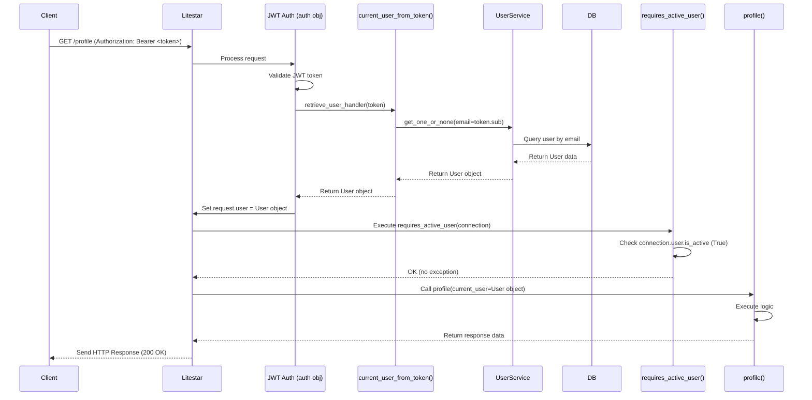

# Chapter 6: Authentication & Authorization (Guards)

In the [previous chapter](05_database_models___services__sqlalchemy__.md), we learned how to make our application interact with the database using **Models**, **Repositories**, and **Services**. We can now create, read, update, and delete data like user accounts. That's great! But... should *anyone* be able to see *everyone's* profile? Or change *anyone's* settings? Probably not!

We need a security system. We need to know **who** is using our application and **what** they are allowed to do. This is where **Authentication** and **Authorization** come in, and Litestar uses something called **Guards** to help enforce the rules.

**Use Case:** Imagine we have a user profile page at the web address `/profile`. We only want *logged-in* users to be able to see their *own* profile. And maybe there's an admin dashboard at `/admin` that only *special* users (superusers) can access. How do we enforce these access rules?

## What Problem Does Security Solve?

Web applications often deal with sensitive information or actions: user profiles, private messages, administrative tasks like deleting users, etc. Without a security system:

*   Anyone could potentially view or modify anyone else's data.
*   Anyone could potentially perform administrative actions.
*   Our application wouldn't be safe or trustworthy.

We need to:

1.  **Authenticate:** Verify the identity of a user (prove they are who they say they are).
2.  **Authorize:** Determine if an authenticated user has permission to perform a specific action or access a specific resource.

## Key Concepts

Let's break down the key ideas, using our building analogy:

### 1. Authentication (Checking ID at the Front Desk)

*   **What it is:** The process of verifying a user's identity. Think of it like the reception desk in an office building checking your photo ID before letting you in.
*   **How it typically works:** A user provides credentials (like an email and password). The system checks if these match a known user account ([Chapter 5: Database Models & Services (SQLAlchemy)](05_database_models___services__sqlalchemy__.md) handles the checking part).
*   **In `litestar-fullstack`:** When you log in successfully, the server gives your browser a special digital "pass" called a **JSON Web Token (JWT)**. For future requests, your browser automatically shows this pass to the server to prove it's still you.

### 2. Authorization (Checking Badges at Specific Doors)

*   **What it is:** The process of checking if an *already authenticated* user has permission to do something specific. Just because you're allowed *into* the building (authenticated) doesn't mean you can enter every room. You might need a special access badge for the server room or the CEO's office.
*   **How it works:** Once we know *who* the user is (thanks to authentication), we check their permissions (e.g., are they an admin? are they a member of the team they're trying to access?) before allowing them to proceed.
*   **In `litestar-fullstack`:** This is primarily handled by **Litestar Guards**. These are functions that run *before* your main API endpoint code ([Chapter 3: API Controllers](03_api_controllers_.md)) executes. They check the user's permissions and either let the request continue or block it.

### 3. JSON Web Tokens (JWT - The Digital Pass)

*   **What it is:** A compact, secure way to represent information (called "claims") between two parties. After you log in, the server generates a JWT containing information like your user ID (or email) and an expiration time. This token is cryptographically signed by the server using a secret key ([Chapter 2: Application Configuration (Settings)](02_application_configuration__settings__.md)).
*   **How it's used:** The server sends this JWT back to your browser. Your browser stores it (usually in local storage or memory) and includes it in the `Authorization` header of subsequent requests to the server (typically as a "Bearer token").
*   **Verification:** When the server receives a request with a JWT, it verifies the signature using its secret key. If the signature is valid and the token hasn't expired, the server trusts the information inside the token (like the user ID) and knows the user is authenticated.

### 4. Guards (The Security Checks at the Doors)

*   **What they are:** Python functions in Litestar that you can attach to specific API routes or entire controllers.
*   **What they do:** They automatically receive information about the current request, including the authenticated user (obtained from the JWT). They contain logic to check if this user meets certain criteria (e.g., `is_active`, `is_superuser`).
*   **Outcome:**
    *   If the check passes, the guard does nothing, and Litestar proceeds to run the actual route handler code.
    *   If the check fails, the guard typically raises a specific exception (like `PermissionDeniedException`). Litestar catches this and automatically sends an error response back to the client (e.g., a `403 Forbidden` error), preventing the route handler from running.

## How it Works in `litestar-fullstack`

The `litestar-fullstack` template comes pre-configured with a robust authentication and authorization system based on JWT and guards.

### 1. Logging In

The login process involves several components working together:

*   **Frontend:** Sends the user's email and password to the `/login` API endpoint.
*   **API Controller (`AccessController`):** Receives the request. It uses the `UserService` to verify the credentials.

    ```python
    # File: src/app/domain/accounts/controllers/access.py (Simplified login)

    from litestar import Controller, post, Response
    from litestar.params import Body
    from litestar.enums import RequestEncodingType

    # Import the schema for login data and the user service
    from app.domain.accounts.schemas import AccountLogin
    from app.domain.accounts.services import UserService
    # Import the 'auth' object that handles JWT creation
    from app.domain.accounts.guards import auth

    class AccessController(Controller):
        # ... other setup ...

        @post(path="/login", exclude_from_auth=True) # No auth needed to log in
        async def login(
            self,
            users_service: UserService, # Injected service
            data: AccountLogin # Validated input data
        ) -> Response: # Returns a Response containing the token
            """Authenticate a user."""
            # Ask the service to check email/password
            user = await users_service.authenticate(data.username, data.password)
            # If successful, 'auth.login' creates the JWT response
            return auth.login(identifier=user.email)
    ```

    *   **Explanation:** The controller receives the login data (`data`), asks the `UserService` to `authenticate` it. If successful, `auth.login(identifier=user.email)` generates the JWT containing the user's email and packages it into the correct HTTP response to send back to the browser.

*   **Service (`UserService`):** Contains the `authenticate` method ([Chapter 5: Database Models & Services (SQLAlchemy)](05_database_models___services__sqlalchemy__.md)) that fetches the user by email and securely compares the provided password with the stored hash.

### 2. Handling Subsequent Requests (Using the JWT)

Once logged in, the browser sends the JWT back with every request. The backend needs to:
*   Extract the token from the `Authorization: Bearer <token>` header.
*   Validate the token's signature and expiration.
*   Fetch the corresponding user from the database.

This is handled automatically by the `OAuth2PasswordBearerAuth` object configured in `src/app/domain/accounts/guards.py`:

```python
# File: src/app/domain/accounts/guards.py (Simplified Auth Setup)

from litestar.security.jwt import OAuth2PasswordBearerAuth, Token
from sqlalchemy.ext.asyncio import AsyncSession # For DB session typing
from litestar.connection import ASGIConnection

# Import our User model and Service
from app.db import models as m
from app.domain.accounts.services import UserService
from app.config import get_settings

settings = get_settings()

# --- This function fetches the User based on the token ---
async def current_user_from_token(token: Token, connection: ASGIConnection) -> m.User | None:
    """Lookup current user from JWT token."""
    # Get a database session (details omitted for brevity)
    db_session: AsyncSession = await auth.get_session(connection)
    # Create a user service instance with the session
    user_service = UserService(session=db_session)
    # Use the token subject (user email) to find the user
    user = await user_service.get_one_or_none(email=token.sub)
    # Return the user only if they exist and are active
    return user if user and user.is_active else None

# --- This is the main Authentication object ---
auth = OAuth2PasswordBearerAuth[m.User](
    retrieve_user_handler=current_user_from_token, # Use our function ^
    token_secret=settings.app.SECRET_KEY,       # Secret for signing tokens
    token_url="/api/account/login",                  # The login endpoint URL
    exclude=["/api/account/login", "/api/account/register", "/schema"], # Paths that DON'T need auth
)
```

*   **Explanation:**
    *   `current_user_from_token` is the crucial function. Litestar calls this *after* it successfully validates a JWT found in a request. It takes the token's subject (`token.sub`, which we set to be the user's email during login) and uses the `UserService` to fetch the full `User` object from the database.
    *   The `auth` object is configured to use `current_user_from_token` to load the user. It also knows the secret key for validation and which paths (like login and registration) don't require a token at all.
    *   **Result:** For any request that requires authentication (i.e., is not in the `exclude` list) and provides a valid JWT, Litestar automatically runs `current_user_from_token` and makes the resulting `User` object available via `request.user`.

### 3. Using Guards for Authorization

Now that `request.user` is reliably populated for authenticated users, we can use Guards to check permissions. `litestar-fullstack` provides several common guards in `src/app/domain/accounts/guards.py`.

**Example 1: Protecting the `/profile` endpoint**

We only want active, logged-in users to access their profile. We can use the `requires_active_user` guard.

```python
# File: src/app/domain/accounts/guards.py (Guard Definition)

from litestar.exceptions import PermissionDeniedException
from litestar.connection import ASGIConnection
from litestar.handlers.base import BaseRouteHandler

def requires_active_user(connection: ASGIConnection, _: BaseRouteHandler) -> None:
    """Request requires active user."""
    # 'connection.user' is populated by the 'auth' mechanism
    if connection.user.is_active:
        return # User is active, allow access
    # If not active, raise an exception
    raise PermissionDeniedException("Inactive account")
```

```python
# File: src/app/domain/accounts/controllers/access.py (Using the Guard)

from litestar import Controller, get
# Import the guard function
from app.domain.accounts.guards import requires_active_user
from app.domain.accounts.schemas import User
from app.db import models as m

class AccessController(Controller):
    # ... (login, signup methods) ...

    @get(
        path="/profile",
        guards=[requires_active_user] # Apply the guard here!
    )
    async def profile(self, current_user: m.User) -> User: # 'current_user' is same as request.user
        """User Profile - protected by requires_active_user guard."""
        # If the guard passes, this code runs.
        # We can safely use 'current_user' because the guard ensured they are active.
        return user_service.to_schema(current_user, schema_type=User) # Simplified
```

*   **Explanation:**
    *   We define the `requires_active_user` function. It checks the `is_active` flag on the `connection.user` object. If `False`, it raises `PermissionDeniedException`.
    *   In the `AccessController`, we add `guards=[requires_active_user]` to the `@get("/profile")` decorator.
    *   Now, before the `profile` method can run, Litestar executes the `requires_active_user` guard. If the user isn't active (or not logged in, meaning `connection.user` wouldn't be set properly), the guard raises the exception, access is denied (403 response), and the `profile` code is never reached.

**Example 2: Protecting an `/admin` endpoint**

Only superusers should access this. We use the `requires_superuser` guard.

```python
# File: src/app/domain/accounts/guards.py (Guard Definition)

def requires_superuser(connection: ASGIConnection, _: BaseRouteHandler) -> None:
    """Request requires active superuser."""
    if connection.user.is_superuser:
        return # User is a superuser, allow access
    raise PermissionDeniedException("Insufficient privileges")
```

```python
# File: hypothetical_admin_controller.py (Using the Guard)

from litestar import Controller, get
# Import the guard function
from app.domain.accounts.guards import requires_superuser

class AdminController(Controller):
    path = "/admin"
    guards = [requires_superuser] # Apply guard to ALL routes in this controller

    @get("/dashboard")
    async def admin_dashboard(self, current_user: m.User) -> dict:
        """Admin dashboard - protected by requires_superuser."""
        # This code only runs if the user is a superuser.
        return {"message": f"Welcome Superuser {current_user.email}!"}
```

*   **Explanation:**
    *   The `requires_superuser` guard checks the `is_superuser` flag.
    *   By putting `guards=[requires_superuser]` directly in the `AdminController` class definition, this guard applies to *all* routes defined within that controller (`/admin/dashboard` in this case). Only users with `is_superuser=True` can access these routes.

## Under the Hood: Request Flow with Authentication & Guards

Let's trace a request to the protected `/profile` endpoint:

1.  **Request:** Browser sends `GET /profile` with `Authorization: Bearer <valid_jwt>` header.
2.  **Litestar Routing:** Litestar receives the request and identifies the route (`/profile`) and its associated handler (`AccessController.profile`).
3.  **Authentication Middleware:** The `OAuth2PasswordBearerAuth` middleware (`auth` object) intercepts the request *before* routing concludes.
    *   It finds the `Authorization: Bearer` header.
    *   It extracts the `<valid_jwt>` token.
    *   It verifies the token's signature and expiration using the `SECRET_KEY`. (If invalid, stops here with a 401 Unauthorized error).
    *   It calls the `retrieve_user_handler` (our `current_user_from_token` function).
4.  **User Retrieval (`current_user_from_token`):**
    *   Gets a database session.
    *   Creates a `UserService` instance.
    *   Extracts the email from the token's `sub` field.
    *   Queries the database: `SELECT * FROM user_account WHERE email = ?`.
    *   Checks if the user exists and `is_active`.
    *   Returns the `User` object (or `None`).
5.  **Populate `request.user`:** The authentication middleware receives the `User` object and attaches it to the request state, making it available as `request.user` (and `connection.user`).
6.  **Guard Execution:** Litestar sees the `guards=[requires_active_user]` on the `/profile` route. It calls the `requires_active_user` function, passing the `connection` (which now has `connection.user` populated).
7.  **Permission Check:** The guard checks `connection.user.is_active`. Let's assume it's `True`. The guard returns `None` (no exception).
8.  **Handler Execution:** Since the guard passed, Litestar proceeds to call the `profile` route handler method, injecting the `current_user` (which is `request.user`).
9.  **Response:** The `profile` method runs, generates its response, and Litestar sends it back to the browser.

Here's a simplified diagram of that flow:



If the token was invalid, `AuthMiddleware` would send a 401 error. If `requires_active_user` found `is_active` to be `False`, `Guard` would raise an exception, and Litestar would send a 403 error.

## Conclusion

Authentication (who are you?) and Authorization (what can you do?) are crucial for securing web applications. `litestar-fullstack` uses a standard and secure approach:

*   **Authentication:** Handled via email/password login that issues **JWT** tokens. The `OAuth2PasswordBearerAuth` component automatically validates these tokens on subsequent requests and uses a lookup function (`current_user_from_token`) to load the specific `User` object into `request.user`.
*   **Authorization:** Enforced using **Guards** – functions attached to routes (`@get(guards=[...])`) or entire controllers (`class MyController(Controller): guards=[...]`). These guards run before the main handler, check `request.user` against specific criteria (like `is_active` or `is_superuser`), and block access by raising exceptions if the checks fail.

This system provides a clear and effective way to protect different parts of your application based on user identity and permissions.

Now that we have a secure backend with data storage and API endpoints, how do we build the user interface that people will actually interact with in their browsers?

Next up: [Chapter 7: Frontend Build & Integration (Vite & React)](07_frontend_build___integration__vite___react__.md)

---

Generated by [AI Codebase Knowledge Builder](https://github.com/The-Pocket/Tutorial-Codebase-Knowledge)