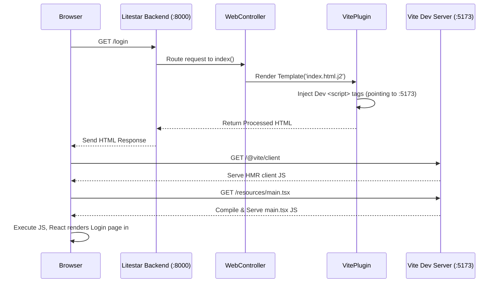
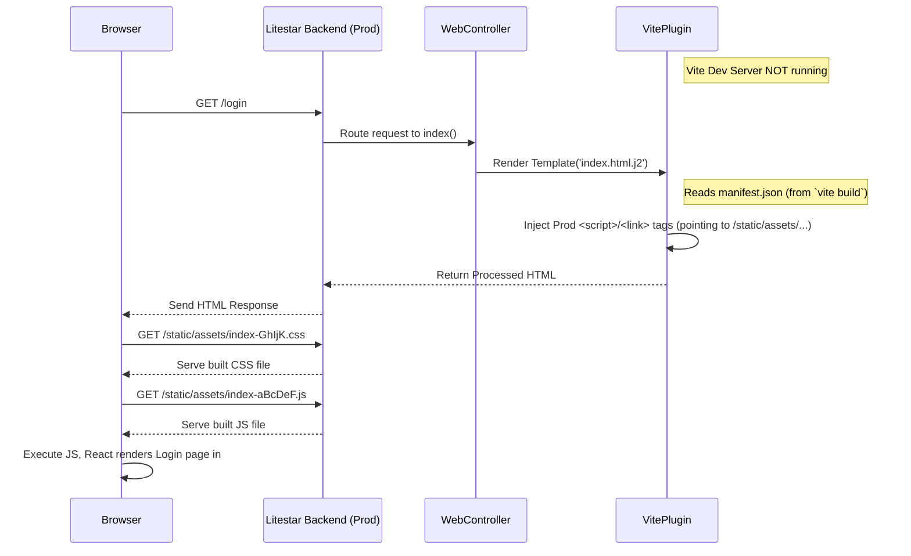

# Chapter 7: Frontend Build & Integration (Vite & React)

In [Chapter 6: Authentication & Authorization (Guards)](06_authentication___authorization__guards__.md), we put security measures in place, ensuring only the right users can access certain parts of our backend API. We can protect user profiles and admin areas. But... where does the user actually *see* their profile or the login page? How do we build the part of our application that runs in the user's web browser?

That's the **frontend**! It's the visual interface – the buttons, forms, text, and layout that users interact with directly. In `litestar-fullstack`, the frontend is built using **React** and managed by a tool called **Vite**.

**Use Case:** How do we display the login form we talked about in Chapter 6? When a user visits `/login` in their browser, how is the HTML page with the email and password fields generated and shown?

## Problem: Connecting Backend Logic to User Interaction

Our backend (built with Litestar) is great at handling data, logic, and security. But it doesn't inherently know how to draw buttons or display interactive forms in a user's browser. We need a separate system for that, and we need a way for the backend and frontend to work together smoothly.

## Key Concepts

Think of building a house:

1.  **React (The Building Blocks):** Imagine React as a huge box of sophisticated Lego bricks. Each brick is a reusable **component** – a piece of the user interface (UI) like a button, a text input field, a user profile card, or even a whole page layout. We assemble these components to build complex interfaces. React helps manage how these blocks look and how they change when users interact with them.

2.  **Vite (The Construction Site Manager):** Imagine Vite as the super-efficient manager of the construction site where you're assembling your Lego house. Vite does several important jobs:
    *   **Development Server:** During development, Vite runs a super-fast local server. When you change your React code (a Lego brick), Vite instantly updates the page in your browser without you needing to manually refresh (**Hot Module Replacement - HMR**). This makes building the UI incredibly fast.
    *   **Compiler/Bundler:** Your React code is often written in modern formats like TypeScript (TS) and JSX (a mix of HTML-like syntax in JavaScript). Browsers don't understand these directly. Vite compiles them into standard JavaScript that browsers *can* understand. For production, Vite also **bundles** all your code (JavaScript, CSS, images) into optimized files for faster loading.
    *   **Asset Handling:** Manages your static files like CSS stylesheets, images, and fonts.

3.  **Integration (Connecting the House to Utilities):** How does the backend (Litestar) deliver the initial empty "plot" (HTML page) where the frontend (React/Vite) can start building? How do they talk to each other?
    *   **Backend Serves Initial HTML:** The Litestar backend serves a very basic HTML file. This file is like the foundation of the house.
    *   **Connecting to Vite (Dev):** During development, this HTML file contains special instructions (tags) added by the `litestar-vite` plugin. These tags tell the browser to fetch the actual JavaScript and CSS directly from the **Vite development server**.
    *   **Using Built Assets (Production):** When you deploy your app, you first run `vite build`. This creates optimized JS and CSS files. The backend then serves the *same* HTML foundation, but the `litestar-vite` plugin changes the instructions to point to these *built, optimized* files, which are now also served by Litestar itself.

## How it Works in `litestar-fullstack`

Let's see how these pieces fit together to display our login page.

**1. Frontend Code Location:**
All the frontend source code (React components, CSS, etc.) lives in the `resources/` directory at the root of the project.
*   `resources/main.tsx`: The entry point for the React application.
*   `resources/App.tsx`: The main React component that sets up routing between different pages.
*   `resources/pages/`: Contains components for different pages (e.g., `Login.tsx`, `Home.tsx`).
*   `resources/components/`: Contains reusable UI components (buttons, forms, etc.).
*   `resources/contexts/`: Holds shared application state (like authentication status).

**2. Vite Configuration (`vite.config.ts`):**
This file tells Vite how to behave.

```typescript
// File: vite.config.ts (Simplified)
import { defineConfig } from "vite"
import path from "path"
import litestar from "litestar-vite-plugin" // The Litestar integration plugin
import react from "@vitejs/plugin-react"   // Plugin for React support

export default defineConfig({
  // Where frontend assets are served FROM (e.g., /static/)
  base: `/static/`,
  server: {
    // Allows connections from any network interface (needed for Docker/VMs)
    host: "0.0.0.0",
    // Port the Vite dev server runs on
    port: 5173,
    cors: true, // Allow backend (on different port) to fetch assets
    hmr: { host: "localhost" }, // How browser connects back for Hot Reloading
  },
  plugins: [
    react(), // Enables React features (JSX, Fast Refresh)
    litestar({ // Configures the Litestar <-> Vite bridge
      input: ["resources/main.tsx"], // Main entry point for the app
      bundleDirectory: "src/app/domain/web/public", // Where built files go
      resourceDirectory: "resources", // Location of frontend source code
      hotFile: "src/app/domain/web/public/hot", // Signal file for HMR
    }),
  ],
  resolve: {
    alias: { // Shortcut for imports (e.g., '@/components/Button')
      "@": path.resolve(__dirname, "resources"),
    },
  },
})
```

*   **Explanation:**
    *   `base: '/static/'`: Tells Vite that when building for production, assets will be served under the `/static/` URL path.
    *   `server`: Configures the Vite development server (port, host). `cors: true` is important so the backend (running on a different port, e.g., 8000) can request assets from Vite (running on 5173).
    *   `plugins`: We include the `react()` plugin for React-specific features and the `litestar()` plugin (from `litestar-vite-plugin`) which handles the integration with the Litestar backend. It knows where our code lives (`resourceDirectory`) and where to put built files (`bundleDirectory`).
    *   `resolve.alias`: Sets up a handy shortcut `@` so we can write `import Button from '@/components/Button'` instead of `import Button from './components/Button'`.

**3. React Entry Point (`resources/main.tsx`):**
This is where the React application starts.

```typescript
// File: resources/main.tsx (Simplified)
import "vite/modulepreload-polyfill" // Vite helper

import React from "react"
import ReactDOM from "react-dom/client"
import App from "@/App.tsx" // Our main App component
import "@/main.css" // Global styles
import { BrowserRouter } from "react-router-dom" // For handling browser URLs
import AuthProvider from "@/contexts/AuthProvider.tsx" // Manages login state

// Find the HTML element with id 'root' and render our React App inside it
ReactDOM.createRoot(document.getElementById("root")!).render(
  <React.StrictMode> {/* Helps catch potential problems */}
    <BrowserRouter> {/* Enables page routing */}
      <AuthProvider> {/* Makes login info available to all components */}
        <App /> {/* The main application component */}
      </AuthProvider>
    </BrowserRouter>
  </React.StrictMode>
)
```

*   **Explanation:** This script finds an HTML element with the ID `root` (which the backend will provide) and tells React to render the main `<App />` component inside it. It also wraps the App with `BrowserRouter` (to handle navigation between pages like `/home` and `/login`) and `AuthProvider` (to manage authentication state across the app, using the JWT token from [Chapter 6: Authentication & Authorization (Guards)](06_authentication___authorization__guards__.md)).

**4. The Main React App (`resources/App.tsx`):**
This component defines the different pages (routes) of our application.

```typescript
// File: resources/App.tsx (Simplified)
import { Route, Routes } from "react-router-dom" // React Router components
// Import page components
import ProtectedRoutes from "@/lib/protected-routes" // Handles requiring login
import Login from "@/pages/access/Login"
import Home from "@/pages/Home"
import PageNotFound from "@/pages/PageNotFound"
import { ThemeProvider } from "@/components/theme-provider" // For dark/light mode

const App: React.FC = () => {
  // ... (logic to redirect if logged in and visiting /login) ...

  return (
    <ThemeProvider> {/* Enables theme switching */}
      <Routes> {/* Defines the available pages */}
        {/* Routes inside ProtectedRoutes require login */}
        <Route path="/" element={<ProtectedRoutes />}>
          <Route index element={<Home />} /> {/* The home page at '/' */}
          {/* Other protected pages go here */}
        </Route>

        {/* Public routes */}
        <Route path="/login" element={<Login />} /> {/* The login page */}
        {/* <Route path="/register" element={<Register />} /> */}

        {/* Catch-all for unknown URLs */}
        <Route path="*" element={<PageNotFound />} />
      </Routes>
    </ThemeProvider>
  )
}
export default App
```

*   **Explanation:** It uses `react-router-dom` to define which React component should be displayed based on the URL path. Visiting `/login` will render the `<Login />` component, while visiting `/` will render the `<Home />` component (but only if the user is logged in, thanks to `<ProtectedRoutes />`).

**5. The Backend HTML Template (`src/app/domain/web/templates/site/index.html.j2`):**
This is the basic HTML structure served by Litestar. It uses Jinja2 templating.

```html
{# File: src/app/domain/web/templates/site/index.html.j2 (Simplified) #}
<!doctype html>
<html lang="en">
  <head>
    <meta charset="UTF-8" />
    <meta name="viewport" content="width=device-width, initial-scale=1.0" />
    <title>Litestar Fullstack App</title>

    {# These tags are generated by the litestar-vite plugin #}
    
      {# During DEV, adds script tag to connect to Vite HMR #}
      {{ vite_hmr_client() }}
    

    {# Adds <script> and <link rel="stylesheet"> tags #}
    {# Dev: Points to Vite dev server (e.g., http://localhost:5173/resources/main.tsx) #}
    {# Prod: Points to built assets (e.g., /static/assets/index-aBcDeF.js) #}
    {{ vite_asset('resources/main.tsx') }}
  </head>
  <body>
    {# This is where our React app will be injected #}
    <div id="root"></div>
  </body>
</html>

```

*   **Explanation:**
    *   It's a very standard HTML structure.
    *   The key parts are the `{{ vite_hmr_client() }}` and `{{ vite_asset('resources/main.tsx') }}` tags. These are special functions provided by the `litestar-vite` plugin.
    *   `vite_hmr_client()`: Only outputs something during development. It adds a `<script>` tag that connects the browser to the Vite server for Hot Module Replacement.
    *   `vite_asset('resources/main.tsx')`: This is the magic part.
        *   *In development:* It renders `<script type="module" src="http://localhost:5173/resources/main.tsx"></script>` (or similar), telling the browser to load the main JavaScript file directly from the Vite dev server.
        *   *In production:* After you run `vite build`, Vite generates a manifest file mapping `resources/main.tsx` to the final built asset (e.g., `/static/assets/index-aBcDeF.js` and `/static/assets/index-GhIjK.css`). The plugin reads this manifest and renders the correct `<script>` and `<link rel="stylesheet">` tags pointing to these optimized files served by Litestar.
    *   `<div id="root"></div>`: This is the empty container where our React app (`resources/main.tsx`) will be attached.

**6. Backend Controller (`src/app/domain/web/controllers.py`):**
This simple Litestar controller serves the HTML template.

```python
# File: src/app/domain/web/controllers.py (Simplified)
from litestar import Controller, get
from litestar.response import Template
from litestar.status_codes import HTTP_200_OK

from app.config import constants # Contains URL paths

class WebController(Controller):
    include_in_schema = False # Don't show in API docs
    opt = {"exclude_from_auth": True} # No login needed to load the base HTML

    @get(
        # Match the root '/' or any other path (for client-side routing)
        path=[constants.SITE_INDEX, f"{constants.SITE_INDEX}/{{path:path}}"],
        status_code=HTTP_200_OK,
    )
    async def index(self, path: str | None = None) -> Template:
        """Serve site root HTML template."""
        # Tell Litestar to render the 'index.html.j2' template
        return Template(template_name="site/index.html.j2")
```

*   **Explanation:** When a user navigates to `/` (or `/login`, `/profile`, etc.), this controller catches the request and simply returns the `index.html.j2` template. The `litestar-vite` plugin ensures the Jinja2 template rendering process includes the correct Vite tags mentioned above. All subsequent navigation (like clicking a link to go from `/home` to `/settings`) is handled *client-side* by React Router within the browser, without needing to ask the backend for a new HTML page each time (unless you do a full page refresh).

**7. Plugin Registration:**
The `VitePlugin` needs to be added to the Litestar application in the [Litestar Application Core](01_litestar_application_core_.md).

```python
# File: src/app/server/plugins.py (Relevant Line)
from litestar_vite import VitePlugin
from app.config import app as config # Import pre-configured Vite settings

# Instantiate the plugin using the configuration from app/config/app.py
vite = VitePlugin(config=config.vite)
```

```python
# File: src/app/server/core.py (Inside ApplicationCore.on_app_init)
# ... other imports ...
from app.server import plugins # Where 'vite' instance lives

class ApplicationCore(...):
    def on_app_init(self, app_config: AppConfig) -> AppConfig:
        # ...
        app_config.plugins.extend([
            # ... other plugins like database ...
            plugins.vite, # Add the configured Vite plugin
            # ...
        ])
        # ...
        # Register the WebController
        app_config.route_handlers.append(WebController)
        # ...
        return app_config

```

*   **Explanation:** This setup ensures Litestar knows about Vite and activates the integration features (like the Jinja2 tags and serving static files).

## Under the Hood: Development Flow

What happens when you run the app locally (using `make dev`) and visit `/login`?

1.  **Start Servers:** You run `make dev` which typically starts both the Litestar backend server (e.g., on `http://localhost:8000`) and the Vite development server (e.g., on `http://localhost:5173`).
2.  **Browser Request:** You navigate your browser to `http://localhost:8000/login`.
3.  **Litestar Handles Request:** The `WebController` on the Litestar backend receives the request for `/login`.
4.  **Serve Template:** The `index` method returns the `index.html.j2` template.
5.  **Inject Vite Tags (Dev):** The `litestar-vite` plugin processes the template:
    *   `{{ vite_hmr_client() }}` adds `<script type="module" src="http://localhost:5173/@vite/client"></script>`.
    *   `{{ vite_asset('resources/main.tsx') }}` adds `<script type="module" src="http://localhost:5173/resources/main.tsx"></script>`.
6.  **HTML Response:** Litestar sends the processed HTML back to the browser.
7.  **Browser Parses HTML:** The browser receives the HTML.
8.  **Fetch Assets from Vite:** The browser sees the `<script>` tags pointing to `localhost:5173` and sends requests *to the Vite dev server* to fetch `@vite/client` and `/resources/main.tsx`.
9.  **Vite Serves Assets:** The Vite server compiles the `main.tsx` (and any components it imports) on the fly and sends the resulting JavaScript back to the browser. It also serves any necessary CSS.
10. **React Renders:** The browser executes the JavaScript (`main.tsx`). React takes over the `<div id="root">`, sees the URL is `/login`, and renders the `<Login />` component. The Vite client script establishes a connection for HMR.
11. **View Login Page:** You see the login page rendered by React. If you change `Login.tsx`, Vite pushes the update, and the page changes without a full refresh!



## Under the Hood: Production Flow

What happens after you build the frontend (`make vite-build`) and run the app in production mode?

1.  **Build Frontend:** `make vite-build` (or `npm run build`) runs `vite build`. Vite compiles and bundles all React code, CSS, etc., into optimized files (e.g., `index-aBcDeF.js`, `index-GhIjK.css`) and places them in `src/app/domain/web/public/assets/`. It also creates a `manifest.json` file mapping original files to built ones.
2.  **Start Server:** You start only the Litestar backend server in production mode. The Vite dev server is *not* running.
3.  **Browser Request:** User navigates to `https://your-app.com/login`.
4.  **Litestar Handles Request:** `WebController` receives the request for `/login`.
5.  **Serve Template:** `index` method returns `index.html.j2`.
6.  **Inject Vite Tags (Prod):** `litestar-vite` plugin processes the template:
    *   `{{ vite_hmr_client() }}` outputs nothing.
    *   `{{ vite_asset('resources/main.tsx') }}` reads the `manifest.json`, finds the built asset names, and renders `<link rel="stylesheet" href="/static/assets/index-GhIjK.css"><script type="module" src="/static/assets/index-aBcDeF.js"></script>`.
7.  **HTML Response:** Litestar sends the processed HTML back.
8.  **Browser Parses HTML:** Browser receives the HTML.
9.  **Fetch Assets from Litestar:** Browser sees `<script>` and `<link>` tags pointing to `/static/assets/...` and sends requests *to the Litestar backend* to fetch these files.
10. **Litestar Serves Static Assets:** Litestar has built-in static file serving capabilities. Since the `ViteConfig`'s `bundle_dir` points to `src/app/domain/web/public`, Litestar serves the requested JS/CSS files from `/static/` (as configured by `vite.config.ts`'s `base` option).
11. **React Renders:** Browser executes the optimized JavaScript bundle. React takes over `<div id="root">`, sees the URL is `/login`, and renders the `<Login />` component.
12. **View Login Page:** You see the login page, loaded using optimized, static assets served by the main backend application.



## Conclusion

Building a modern web application involves both a backend (handling logic and data) and a frontend (providing the user interface). `litestar-fullstack` uses **React** to build the UI as reusable components and **Vite** as the development server and build tool.

The key integration happens via the `litestar-vite` plugin:
*   During **development**, Litestar serves a basic HTML shell, and the browser loads JavaScript/CSS directly from the fast Vite dev server, enabling Hot Module Replacement for quick UI updates.
*   For **production**, Vite bundles and optimizes the frontend code. Litestar serves the same HTML shell but modifies it to point to these optimized static files, which are then served efficiently by Litestar itself.

This setup gives you a powerful and fast development experience with React and Vite, while ensuring an optimized and well-integrated frontend for your deployed application.

With our backend handling data, security, and now serving a dynamic frontend, what about tasks that need to run outside the immediate request-response cycle, like sending emails or performing periodic cleanup?

Next up: [Chapter 8: Background Tasks (SAQ)](08_background_tasks__saq__.md)

---

Generated by [AI Codebase Knowledge Builder](https://github.com/The-Pocket/Tutorial-Codebase-Knowledge)