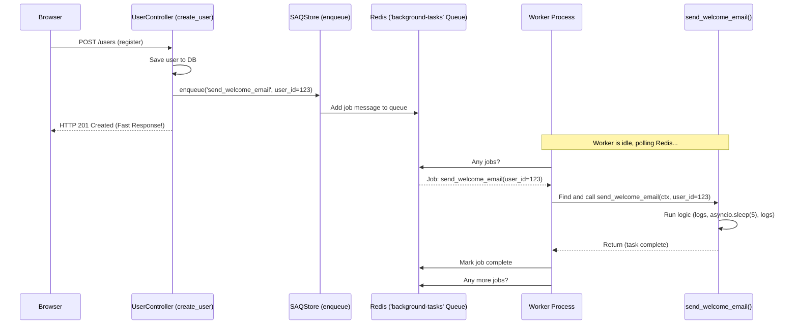

# Chapter 8: Background Tasks (SAQ)

Welcome back! In [Chapter 7: Frontend Build & Integration (Vite & React)](07_frontend_build___integration__vite___react__.md), we learned how the user interface in the browser (built with React and Vite) connects to our Litestar backend. Now users can interact with our application, log in, and see different pages.

But what about tasks that shouldn't make the user wait? Imagine a user signs up for our application. We want to send them a "Welcome!" email. Should the user stare at a loading spinner for 5-10 seconds while our server connects to an email service and sends the message? Probably not! Their account is created, they should be able to start using the app immediately. Sending the email can happen a moment later, behind the scenes.

This is where **Background Tasks** come in. They handle work that runs *independently* of the main web request-response cycle.

**Use Case:** When a new user successfully registers, we want to send them a welcome email *without* delaying the response that tells their browser the registration was successful.

## Why Do We Need Background Tasks?

Think of our web application like a busy restaurant:

*   **Web Server (Litestar):** The waiter taking orders and serving food quickly. This is the main request-response cycle. Needs to be fast and responsive.
*   **User:** The customer at the table. Doesn't want to wait long after ordering.
*   **Time-Consuming Tasks:** Things like preparing a complex dish that takes 30 minutes, doing inventory at the end of the day, or deep cleaning the kitchen.

You wouldn't make a customer wait at the table while the waiter goes to deep clean the kitchen! That cleaning task happens *in the background*, maybe after hours, or by separate staff in the back, without blocking the main service.

Similarly, in web applications, some tasks are:

*   **Slow:** Like sending emails (connecting to external services can be slow), generating large reports, processing uploaded images or videos.
*   **Scheduled:** Need to run at specific times (e.g., daily database backups, sending out a newsletter every Friday).
*   **Less Critical for Immediate Response:** The user doesn't need confirmation *right now* that the welcome email was sent, only that their account was created.

Running these tasks directly within the web request would make the application feel slow and unresponsive. Background tasks solve this by offloading the work.

## The Back Office: SAQ and Redis

`litestar-fullstack` uses a library called **SAQ (Simple Asynchronous Queue)** along with **Redis** to manage these background tasks. Here's how the components work together, using our "back office" analogy:

1.  **Task Queue (The Inbox):** When the waiter (web server) needs the back office to do something (like send a welcome email), they don't do it themselves. They write down the request (a "job") and put it in a central inbox. SAQ uses **Redis** (an in-memory data store, often used as a fast message broker) to act as this highly efficient inbox. There can be multiple inboxes (queues) for different types of tasks.

2.  **Job (The Work Order):** A specific instruction placed in the queue. It contains information like:
    *   Which task needs to be done (e.g., "send_welcome_email").
    *   Any data needed for the task (e.g., "user_id = 123", "email = 'newbie@example.com'").

3.  **Worker (The Back Office Assistant):** A completely separate program that is constantly watching the inbox (Redis queue). When a new job appears, the worker picks it up, performs the task described in the job (e.g., calls the actual `send_welcome_email` Python function), and once finished, looks for the next job. There can be multiple workers handling jobs from the same queue.

4.  **SAQ (The System Manager):** The library that provides the tools to:
    *   Define what tasks the workers know how to do.
    *   Easily put new jobs onto the Redis queue from our main web application.
    *   Run the worker processes.

**In short:** The web application quickly adds a "job" message to a Redis list (the queue) and finishes its request. Separately, a worker process picks up that message from Redis and executes the actual task function.

## How Background Tasks Work in `litestar-fullstack`

Let's implement our use case: sending a (simulated) welcome email after user registration.

**1. Define the Task Function:**

First, we need a Python function that performs the work we want to do in the background. Let's create a simplified function that just logs messages and waits, simulating email sending. Task functions usually live within the relevant domain, e.g., `src/app/domain/accounts/tasks.py`.

```python
# File: src/app/domain/accounts/tasks.py (New File)
import asyncio
from uuid import UUID # Use UUID for user IDs
from saq.types import Context # SAQ context object (optional but standard)
from structlog import get_logger

logger = get_logger() # For logging messages

async def send_welcome_email(ctx: Context, user_id: UUID) -> None:
    """
    A background task to simulate sending a welcome email to a new user.
    'ctx' is provided by SAQ, 'user_id' is the argument we pass.
    """
    # You can access job info via ctx, e.g., ctx["job"].id
    logger.info(f"Starting task: Send welcome email to user {user_id}", task_id=ctx["job"].id)

    # Simulate the time it takes to connect and send an email
    await asyncio.sleep(5) # Pretend it takes 5 seconds

    # In a real app, this is where you'd use an email library
    # email_service.send(to=user_email, subject="Welcome!", body="...")

    logger.info(f"Finished task: Welcome email 'sent' to user {user_id}", task_id=ctx["job"].id)
```

*   **Explanation:**
    *   We define an `async def` function `send_welcome_email`. Background tasks in SAQ are typically asynchronous.
    *   It accepts `ctx` (SAQ context) and `user_id` (the data needed for this job).
    *   It logs the start, simulates work with `asyncio.sleep(5)`, and logs the finish.

**2. Register the Task with SAQ:**

SAQ needs to know that this `send_welcome_email` function exists and that it's a valid task. We register it in the SAQ configuration within the Litestar application setup. We'll add it to the existing `background-tasks` queue.

```python
# File: src/app/config/app.py (Modify the SAQConfig)

# ... other imports ...
from litestar_saq import CronJob, QueueConfig, SAQConfig

# ... other configs (db, vite, etc.) ...

settings = get_settings() # Load settings

saq = SAQConfig(
    # ... other SAQ settings ...
    queue_configs=[
        # ... other queues like "system-tasks" ...
        QueueConfig(
            dsn=settings.redis.URL, # Connects to Redis
            name="background-tasks", # Name of the queue (inbox)
            # List of functions this queue can handle (as strings)
            tasks=[
                "app.domain.system.tasks.background_worker_task", # Existing task
                "app.domain.accounts.tasks.send_welcome_email", # <-- Add our new task here!
            ],
            scheduled_tasks=[ # Tasks that run on a schedule
                CronJob(
                    function="app.domain.system.tasks.background_worker_task",
                    unique=True,
                    cron="* * * * *", # Run every minute
                    timeout=300,
                ),
            ],
        ),
    ],
)
```

*   **Explanation:**
    *   We find the `SAQConfig` object.
    *   Inside `queue_configs`, we locate the `QueueConfig` for the `"background-tasks"` queue.
    *   We add the *full path string* to our new task function (`"app.domain.accounts.tasks.send_welcome_email"`) to the `tasks` list for that queue. Now, the worker watching this queue knows about our function.

**3. Enqueue the Job from the Web Application:**

Now, we need to trigger this task when a user is created. We'll modify the `create_user` controller method from [Chapter 5: Database Models & Services (SQLAlchemy)](05_database_models___services__sqlalchemy__.md) to enqueue the job *after* the user is successfully saved to the database.

We use Litestar's dependency injection to get access to the `SAQStore`, which allows us to interact with the queues.

```python
# File: src/app/domain/accounts/controllers/users.py (Modify create_user)

from litestar import Controller, post
from litestar.di import Provide
from litestar_saq import SAQStore # Import the SAQ store type for hinting
from structlog import get_logger

# Import schemas, service, etc.
from app.domain.accounts.schemas import User, UserCreate
from app.domain.accounts.services import UserService
# ... ensure provide_user_service dependency is setup ...

logger = get_logger()

class UserController(Controller):
    path = "/users"
    # Make sure dependencies include user_service
    # SAQStore is automatically available if the SAQPlugin is registered
    dependencies = {"user_service": Provide(provide_user_service)}

    @post(dto="UserCreateDTO", return_dto="UserDTO", sync_to_thread=False)
    async def create_user(
        self,
        data: UserCreate,
        user_service: UserService,
        saq_store: SAQStore, # <-- Inject the SAQ store!
    ) -> User:
        """Handles POST /users to create a new user and enqueue welcome email."""
        # 1. Create the user using the service
        created_user = await user_service.create(data=data)
        logger.info("User created successfully", user_id=created_user.id)

        # 2. Enqueue the background task
        #    Get the specific queue ("background-tasks") from the store
        #    and call enqueue()
        job = await saq_store["background-tasks"].enqueue(
            "send_welcome_email",    # Task function name (string)
            user_id=created_user.id, # Arguments for the function
            # other options like _job_id=... can be added
        )
        logger.info("Enqueued welcome email task", user_id=created_user.id, job_id=job.id)

        # 3. Return the response to the user IMMEDIATELY
        #    The email task will run separately.
        return created_user # Returns User DTO (implicitly)
```

*   **Explanation:**
    *   We add `saq_store: SAQStore` as a parameter to `create_user`. Litestar's dependency injection will provide the configured SAQ store instance.
    *   After `user_service.create()` successfully creates the user, we call `saq_store["background-tasks"].enqueue(...)`.
    *   We pass the *string name* of the task function (`"send_welcome_email"`).
    *   We pass the necessary arguments as keyword arguments (`user_id=created_user.id`). SAQ handles serializing this data for Redis.
    *   The `.enqueue()` call is very fast – it just sends a message to Redis.
    *   The controller then immediately returns the `created_user` data, sending a response back to the browser without waiting for the email task to complete.

**4. Running the Worker:**

The code above only *adds* the job to the queue. Nothing will actually run the `send_welcome_email` function unless we start a worker process.

The `litestar-fullstack` project is set up to run workers using the command: `litestar workers run`

In our development environment using Docker ([Chapter 9: Containerization (Docker)](09_containerization__docker__.md)), the `docker-compose.yml` and `docker-compose.override.yml` files define a separate `worker` service that runs exactly this command.

```yaml
# File: docker-compose.yml (Snippet)
services:
  # ... app, db, cache services ...

  worker:
    build:
      context: .
      dockerfile: deploy/docker/run/Dockerfile # Or dev Dockerfile
    command: litestar workers run # <-- This starts the SAQ worker process
    restart: always
    depends_on: # Make sure Redis and DB are ready first
      db:
        condition: service_healthy
      cache:
        condition: service_healthy
    env_file:
      - .env.docker.example # Needs DB/Redis connection info
```

*   **Explanation:** This `worker` service runs in a separate container. It starts the Litestar application context (so SAQ knows about the tasks and Redis connection from `SAQConfig`), connects to Redis, and continuously checks the queues (`background-tasks`, `system-tasks`) defined in `SAQConfig`. When it finds a job, it executes the corresponding Python function.

## Under the Hood: The Journey of a Background Job

Let's trace the flow when the `UserController` enqueues the `send_welcome_email` task:

1.  **Enqueue:** The `create_user` handler calls `saq_store["background-tasks"].enqueue("send_welcome_email", user_id=123)`.
2.  **SAQ -> Redis:** The SAQ library creates a "job" message containing the task name and arguments (`{'function': 'send_welcome_email', 'kwargs': {'user_id': 123}, ...other_metadata...}`). It sends this message to the Redis server, adding it to the list named `saq:background-tasks:queue`.
3.  **Web Response:** The `enqueue` call returns quickly. The `create_user` handler finishes and Litestar sends a `201 Created` HTTP response back to the user's browser almost immediately. The user sees confirmation that their account is created.
4.  **Worker Polling:** Meanwhile, the separate `worker` process (running `litestar workers run`) is asking Redis: "Are there any jobs in the `saq:background-tasks:queue` list?" (This is a blocking poll, so it waits efficiently).
5.  **Redis -> Worker:** Redis sees the new job message and sends it to the waiting worker.
6.  **Worker Processes Job:** The worker receives the message. It sees the `function` is `"send_welcome_email"`. It looks up the actual Python function `app.domain.accounts.tasks.send_welcome_email`.
7.  **Task Execution:** The worker calls `send_welcome_email(ctx, user_id=123)`, passing the arguments from the job message.
8.  **Task Runs:** Our `send_welcome_email` function executes: it logs the start message, `await asyncio.sleep(5)`, logs the end message.
9.  **Job Completion:** Once the `send_welcome_email` function finishes, the worker notifies Redis that the job is complete (removing it from the active queue).
10. **Worker Waits:** The worker goes back to asking Redis for the next job in the queue.

Here's a visual representation:



## Scheduled Tasks

SAQ isn't just for tasks triggered by web requests. You can also schedule tasks to run at specific times using cron syntax, like the existing `system_upkeep` and `background_worker_task` examples in `src/app/config/app.py`:

```python
# File: src/app/config/app.py (Snippet)
        QueueConfig(
            # ... queue details ...
            scheduled_tasks=[
                CronJob(
                    function="app.domain.system.tasks.system_upkeep", # Task to run
                    unique=True, # Prevents duplicates if worker restarts
                    cron="0 * * * *", # Run at the start of every hour
                    timeout=500, # Max time the job can run
                ),
                # ... other cron jobs ...
            ],
        ),
```

*   **Explanation:** The `CronJob` definition tells the SAQ worker to automatically enqueue a job for the specified `function` according to the `cron` schedule. This is great for periodic maintenance, reports, or other recurring background activities.

## Conclusion

Background tasks are essential for keeping web applications responsive by offloading slow or scheduled work. `litestar-fullstack` uses **SAQ** and **Redis** to manage this effectively:

*   We define tasks as simple Python `async` functions.
*   We register these functions in the `SAQConfig`.
*   We **enqueue** jobs from our web application (e.g., controllers or services) by sending a message to a Redis queue via the injected `SAQStore`. This is fast.
*   A separate **worker** process (started with `litestar workers run`) picks up jobs from the Redis queue and executes the corresponding task functions.

This allows our main web server to handle user requests quickly, while the "back office" workers handle heavier or scheduled tasks independently. Think of it as the waiter taking your order quickly, while the kitchen staff (workers) prepare your meal (the job) using the recipe (task function) from the order ticket (job message) pulled from the order rail (Redis queue).

Now that we have a complete application with a frontend, backend, database, security, and background task processing, how do we package all these different pieces (Litestar app, worker, Redis, database) together so we can easily deploy and run them anywhere? That's where containerization comes in.

Next up: [Chapter 9: Containerization (Docker)](09_containerization__docker__.md)

---

Generated by [AI Codebase Knowledge Builder](https://github.com/The-Pocket/Tutorial-Codebase-Knowledge)