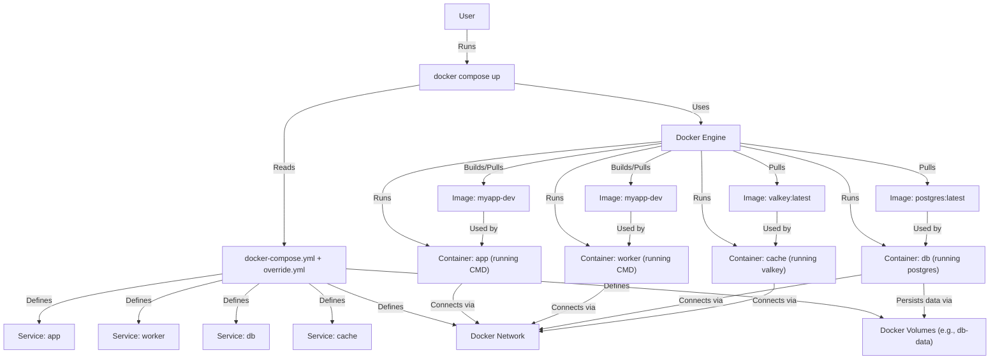

# Chapter 9: Containerization (Docker)

In the [previous chapter](08_background_tasks__saq__.md), we saw how to handle tasks like sending emails in the background using SAQ and Redis, keeping our main application responsive. We now have several moving parts: our main Litestar web application, a background task worker, a PostgreSQL database, and a Redis cache. Getting all these set up correctly on different computers (your machine, your teammate's machine, the production server) can be tricky and error-prone. What if you have a different version of Python installed? Or your teammate uses a different operating system?

This is where **Containerization** with **Docker** comes in. It solves the classic problem: "But it works on my machine!"

**Use Case:** How can we package our entire application – the Python code, the database (Postgres), the cache (Redis), the frontend build tools (Node.js), and all their specific versions and dependencies – so that it runs exactly the same way everywhere, whether it's on your laptop for development, on a test server, or in production?

## Why Do We Need Containerization?

Imagine you're shipping goods overseas. You wouldn't just load individual boxes, bikes, and barrels onto a ship. They could break, get lost, or react badly with each other. Instead, you pack everything neatly into standardized **shipping containers**. These containers protect the goods inside, keep them isolated, and can be easily handled and stacked using standard equipment (cranes, trucks, ships) anywhere in the world.

**Containerization** does the same thing for software. Instead of installing Python, Node.js, Postgres, Redis, and all our application code directly onto every computer's operating system, we package each part into a separate, isolated "container".

Docker is the most popular tool for creating and managing these software containers. Docker Compose is a tool for defining and running multi-container Docker applications.

## Key Concepts

Let's break down the main ideas:

### 1. Container (The Shipping Container)

*   **What it is:** A standardized, isolated package that bundles everything needed to run a piece of software: the code, its specific runtime (like Python 3.11 or Node.js 20), system libraries, and configuration files.
*   **Isolation:** Containers run isolated from each other and from the host computer's operating system. A library installed for the backend container won't interfere with the frontend container or your main computer.
*   **Consistency:** A container image, once built, will run exactly the same way wherever you start a container from it.

### 2. Docker (The Shipping Company)

*   **What it is:** The platform and set of tools used to build, ship, and run containers.
    *   **Docker Engine:** The background service that manages containers (starting, stopping, networking).
    *   **Docker Image:** A read-only **template** or blueprint used to create containers. Think of it as the design document for a specific type of packed shipping container (e.g., "Python 3.11 Backend Container Image"). Images are often built in layers.
    *   **Docker Container:** A **running instance** of a Docker image. You can start, stop, and delete multiple containers from the same image. It's the actual physical shipping container loaded with goods, running on the ship.

### 3. Dockerfile (The Packing List/Blueprint)

*   **What it is:** A text file containing step-by-step instructions on how to build a specific Docker **Image**. It defines the base operating system, copies the application code, installs dependencies, sets environment variables, and specifies the command to run when a container starts.
*   **Analogy:** The detailed instructions for assembling a piece of furniture, or the packing list and instructions for correctly loading a specific type of shipping container.

Here's a *highly simplified* example of what a `Dockerfile` might look like for our Python backend:

```dockerfile
# File: deploy/docker/dev/Dockerfile (Very Simplified)

# 1. Start from an official Python 3.11 base image
FROM python:3.11-slim

# 2. Set the working directory inside the container
WORKDIR /workspace/app

# 3. Copy dependency files
COPY pyproject.toml uv.lock ./

# 4. Install Python dependencies using 'uv'
RUN pip install uv && uv pip install --system --quiet --no-cache --requirement uv.lock

# 5. Copy the rest of the application code
COPY . /workspace/app

# 6. Expose the port the app runs on
EXPOSE 8000

# 7. Command to run when the container starts (in dev mode)
CMD ["litestar", "run", "--reload", "--host", "0.0.0.0", "--port", "8000"]
```

*   **Explanation:**
    *   `FROM`: Specifies the base image (a minimal Linux with Python 3.11).
    *   `WORKDIR`: Sets the current directory for subsequent commands inside the container.
    *   `COPY`: Copies files from your computer into the image.
    *   `RUN`: Executes commands during the image build process (like installing dependencies).
    *   `EXPOSE`: Informs Docker that the container will listen on this port (doesn't actually publish it).
    *   `CMD`: Defines the default command to execute when a container starts from this image.

### 4. Docker Compose (The Logistics Manager)

*   **What it is:** A tool for defining and running applications that use *multiple* Docker containers. It uses a configuration file (usually `docker-compose.yml`) to specify all the services (containers), how they connect, which ports they expose, and which volumes they use for persistent data or code mounting.
*   **Analogy:** The shipping company's logistics manager who plans which containers (app, db, cache, worker) go on which ship, how they are connected (network), and where they load/unload persistent cargo (volumes).

Here's a snippet from `docker-compose.override.yml` defining the `app` and `db` services for development:

```yaml
# File: docker-compose.override.yml (Simplified Snippet)

services:
  app: # The Litestar web application service
    build: # Instructions to build the image
      context: . # Use current directory
      dockerfile: deploy/docker/dev/Dockerfile # Use the dev Dockerfile
    ports: # Map host port 8000 to container port 8000
      - "8000:8000"
    volumes: # Mount local code into container for live updates
      - ./src:/workspace/app/src/ # Mounts local 'src' to container's 'src'
      # ... other volume mounts ...
    depends_on: # Ensure db and cache start first
      db:
        condition: service_healthy
      cache:
        condition: service_healthy
    command: litestar run --reload --host 0.0.0.0 --port 8000 # Dev command

  db: # The PostgreSQL database service
    image: postgres:latest # Use an official pre-built image
    ports:
      - "15432:5432" # Map host 15432 to container 5432 (Postgres default)
    environment: # Set environment variables for the database
      POSTGRES_PASSWORD: "app"
      POSTGRES_USER: "app"
      POSTGRES_DB: "app"
    volumes: # Store DB data persistently on the host machine
      - db-data:/var/lib/postgresql/data
    healthcheck: # Check if the database is ready
      test: ["CMD", "pg_isready", "-U", "app"]
      # ... other healthcheck parameters ...

# Define the volume for persistent DB data
volumes:
  db-data: {}
```

*   **Explanation:**
    *   `services`: Defines the different parts of our application (app, db, cache, worker).
    *   `app`: Defines the main Litestar application container.
        *   `build`: Tells Compose to build an image using the specified `Dockerfile`.
        *   `ports`: Makes the app accessible on `http://localhost:8000`.
        *   `volumes`: This is key for development. It mounts your local project folders directly into the container. When you edit code locally, it's instantly reflected inside the container, allowing Litestar's `--reload` to work.
        *   `depends_on`: Makes sure the `app` container only starts after the `db` and `cache` containers report they are healthy.
    *   `db`: Defines the PostgreSQL container.
        *   `image`: Uses a ready-made image from Docker Hub.
        *   `environment`: Configures the database user, password, and name.
        *   `volumes`: Creates a named volume `db-data`. Docker manages this volume to store the database files persistently, so your data isn't lost when the container stops and restarts.
        *   `healthcheck`: Lets Compose know how to check if Postgres is ready to accept connections.

## How it Solves the Use Case in `litestar-fullstack`

Docker and Docker Compose solve our setup and consistency problem perfectly:

1.  **Packaging:** The `Dockerfile`s (`deploy/docker/dev/Dockerfile` and `deploy/docker/run/Dockerfile`) define exactly how to build the container images for our Litestar app and worker, ensuring the correct Python version, system dependencies (like any needed C libraries), and Python packages are installed inside the image, isolated from your host system. The `docker-compose.yml` uses official images for Postgres and Redis, ensuring consistent versions of those too.
2.  **Orchestration:** The `docker-compose.yml` file defines all the services needed: `app` (Litestar web server), `worker` ([SAQ background tasks](08_background_tasks__saq__.md)), `db` ([PostgreSQL database](05_database_models___services__sqlalchemy__.md)), and `cache` ([Redis](08_background_tasks__saq__.md)). It configures how they connect via an internal Docker network, which ports are exposed, and how data persists.
3.  **Simplified Setup:** Instead of manually installing Python, Node, Postgres, Redis, running migrations, and starting each service, a developer just needs Docker installed. Running one command (like `make dev`, which often wraps `docker compose up`) builds the images (if needed) and starts all the containers in the correct order with the right configuration.
4.  **Consistency:** Because everything runs inside containers built from specific images, the application behaves the same way on your machine, your teammate's machine, and the production server (which would run containers based on the production `Dockerfile` and `docker-compose.yml`).

**Development vs. Production:**

*   `docker-compose.override.yml` is used *in addition* to `docker-compose.yml` during development (`docker compose up` automatically merges them). It adds features useful for development, like:
    *   Using the development `Dockerfile` (`deploy/docker/dev/Dockerfile`) which might install extra debugging tools.
    *   Mounting local source code volumes (`./src:/workspace/app/src/`) for live code reloading.
    *   Running the app with `--reload` enabled.
*   For production (`docker-compose.yml` used alone, potentially with environment variables), you typically:
    *   Use the production `Dockerfile` (`deploy/docker/run/Dockerfile`) which creates a more optimized, smaller image without development dependencies.
    *   Do *not* mount source code volumes (the code is copied into the image during the build).
    *   Run the app using a production-grade server like Uvicorn without reload.

## Under the Hood: `docker compose up`

What happens when you run a command like `make dev`, which usually executes `docker compose up --build -d`?

1.  **Read Compose Files:** Docker Compose reads `docker-compose.yml` and `docker-compose.override.yml` (if present and not explicitly excluded). It merges the configurations, with the override file taking precedence.
2.  **Check Networks/Volumes:** It checks if the Docker networks and volumes defined in the files exist. If not, it creates them (like the `db-data` volume or the default network connecting the services).
3.  **Check Images:** For each service:
    *   If the service specifies a `build` instruction (like our `app` and `worker`), Compose checks if an image needs to be built (due to the `--build` flag or if the `Dockerfile` or its context has changed). If so, it runs `docker build`, executing the steps in the specified `Dockerfile` to create the image layer by layer.
    *   If the service specifies an `image` (like `db` and `cache`), Compose checks if that image exists locally. If not, it pulls it from the Docker registry (like Docker Hub).
4.  **Create & Start Containers:** For each service, Compose creates a container based on the corresponding image.
    *   It connects the container to the specified Docker networks.
    *   It mounts the specified volumes or local directories into the container.
    *   It sets the environment variables.
    *   It starts the container, running the `command` specified in the Compose file or the `CMD` specified in the `Dockerfile`.
    *   It maps ports between the host and the container if specified.
5.  **Dependency Management:** If `depends_on` is used, Compose waits for the dependency containers to be "healthy" (based on their `healthcheck`) before starting the dependent container.
6.  **Running:** All containers are now running in the background (`-d` flag for detached mode), forming your complete application environment. You can access the web app via `localhost:8000`, connect to the database on `localhost:15432`, etc.

Here's a simplified diagram showing the relationship:




## Conclusion

Containerization with Docker and Docker Compose is a cornerstone of modern software development and deployment. For `litestar-fullstack`, it provides:

*   **Consistency:** Ensures the application runs the same way everywhere by packaging dependencies and code into isolated containers.
*   **Simplified Setup:** Reduces the complex setup process to a single `docker compose up` command (often wrapped in `make dev`).
*   **Isolation:** Prevents conflicts between project dependencies and your host machine or other projects.
*   **Environment Management:** Easily defines and manages the multiple services (app, worker, database, cache) required by the application.

By using Docker, we create self-contained units for each part of our application, making development easier and deployment much more reliable. Think of it as having pre-fabricated, standardized rooms (containers) that you can easily assemble (compose) to build your house (application) anywhere.

With our application now fully containerized, how do we manage common development tasks like running tests, formatting code, or managing database migrations efficiently?

Next up: [Chapter 10: Development & CLI Tools (Makefile, Pre-commit, CLI Commands)](10_development___cli_tools__makefile__pre_commit__cli_commands__.md)

---

Generated by [AI Codebase Knowledge Builder](https://github.com/The-Pocket/Tutorial-Codebase-Knowledge)