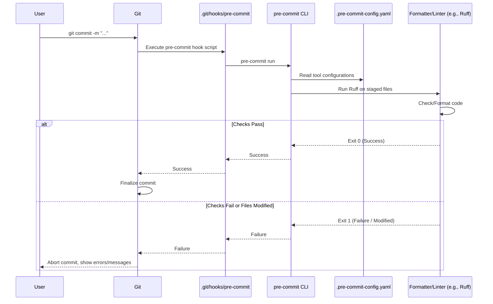
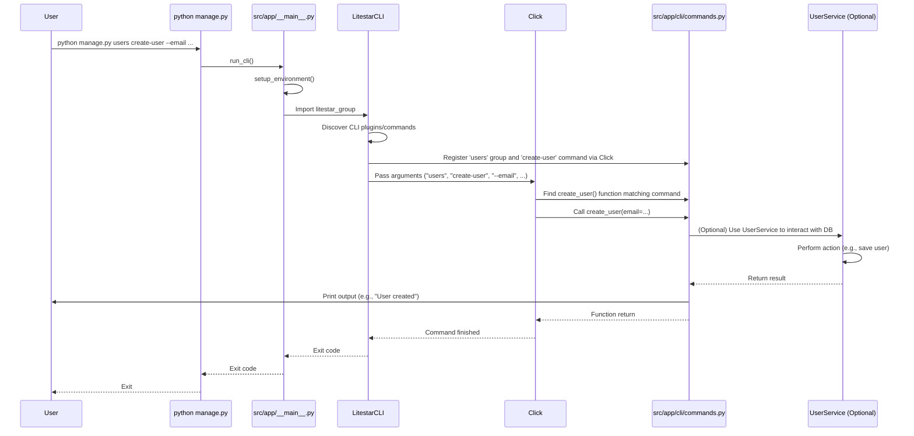

# Chapter 10: Development & CLI Tools (Makefile, Pre-commit, CLI Commands)

In the [previous chapter](09_containerization__docker__.md), we learned how to package our entire application using Docker, making it easy to run consistently across different environments. Now that we have our application bundled up, how do we manage the day-to-day tasks of developing it? Things like installing dependencies, running tests, checking code quality, or even creating a test user in the database? Doing these manually every time would be tedious and error-prone.

This chapter introduces the **developer's toolkit** for `litestar-fullstack`: a set of tools designed to automate common tasks, enforce code quality, and make your development life easier.

**Use Case:** Imagine you've just pulled the latest code changes from your teammate. How do you easily make sure your environment is up-to-date, run all the code quality checks and tests to ensure nothing broke, and maybe create a new user account for manual testing, all without typing long, complicated commands?

## Why Do We Need Development Tools?

Writing code is just one part of building software. You also need to:

*   **Install Dependencies:** Set up the correct versions of all required libraries (Python, Node.js).
*   **Run Checks:** Ensure code follows style guides (formatting), doesn't have obvious errors (linting), and passes all tests.
*   **Manage the Environment:** Start/stop development servers, databases, and other services.
*   **Perform Common Tasks:** Run database migrations, create initial data (like user roles), etc.

Doing these manually is repetitive and leaves room for inconsistency. We need automation!

## Key Concepts: Your Developer Toolkit

`litestar-fullstack` provides three main types of tools to help:

### 1. Makefile (The Shortcut Menu)

*   **What it is:** A file named `Makefile` in the project root that acts like a custom menu of shortcuts for your command line.
*   **How it works:** You define simple "targets" (like `lint`, `test`, `dev`) in the `Makefile`. Each target corresponds to one or more shell commands. Instead of typing a long command like `uv run pytest tests --cov -n auto`, you can just type `make coverage`.
*   **Tool:** Uses the standard `make` command, available on most Linux/macOS systems (and installable on Windows).
*   **Analogy:** Think of it like speed dial on your phone. Instead of dialing the full number every time, you just press one button. `make` lets you run complex commands with short, memorable names.
*   **Location:** `Makefile` in the project root.

### 2. Pre-commit (The Quality Gatekeeper)

*   **What it is:** A tool that automatically runs predefined checks on your code *before* you commit it to Git version control.
*   **How it works:** It installs small scripts (Git hooks) that trigger checks when you run `git commit`. These checks are defined in a configuration file and often include:
    *   **Formatting:** Automatically fixing code style (like indentation, spacing) using tools like Ruff.
    *   **Linting:** Catching potential errors or bad practices (like unused variables) using tools like Ruff.
    *   **Other checks:** Checking for secrets accidentally committed, ensuring file formats are correct, spell-checking code comments.
*   **Benefit:** Helps maintain consistent code quality across the project and catches simple mistakes early, before they even get shared.
*   **Analogy:** Like a spell checker and grammar checker in your word processor that highlights issues before you finalize your document.
*   **Location:** Configuration in `.pre-commit-config.yaml`, installed via `pre-commit install`.

### 3. Litestar CLI & Custom Commands (The App's Toolkit)

*   **What it is:** The command-line interface for interacting with your Litestar application. It includes built-in commands provided by Litestar itself, plus custom commands specific to *your* application's needs.
*   **Litestar Built-in Commands:** Useful for common framework tasks:
    *   `litestar run`: Starts the development server.
    *   `litestar routes`: Shows all the API routes defined in your app.
    *   `litestar --help`: Shows all available commands.
*   **Custom Commands:** Commands added by `litestar-fullstack` (or that you can add yourself) for application-specific management tasks. Examples:
    *   `litestar users create-user`: A command to create a new user account in the database.
    *   `litestar users create-roles`: A command to set up default user roles.
*   **Tool:** Built using the `click` library and integrated into Litestar's CLI system.
*   **Analogy:** Think of it as your application's dedicated control panel accessible from the command line. You can use it to inspect, manage, and interact with your app's data and functions.
*   **Location:** Entry point usually via `manage.py` or `python -m app`. Custom commands defined in `src/app/cli/commands.py`.

## Using the Tools: Solving the Use Case

Let's see how these tools help with our scenario: updating, checking, and testing the application.

### 1. Using the Makefile

After pulling the latest code, you can use `make` for common workflows. Open your terminal in the project root directory.

*   **Install/Update Dependencies:**
    ```bash
    make install
    ```
    *   **Explanation:** This command (defined in the `Makefile`) usually runs `uv sync --all-extras --dev` and `npm install`. It ensures your virtual environment has all the correct Python packages and Node.js packages installed based on the lock files (`uv.lock`, `package-lock.json`). It might also clean up old files first.

*   **Run Code Quality Checks (Linting & Formatting):**
    ```bash
    make lint
    # Or just the formatter/fixer:
    make fix
    ```
    *   **Explanation:** `make lint` typically runs `pre-commit run --all-files` (see below), executing all linters and formatters. `make fix` might run just the automatic formatting tools like `ruff format` and `ruff check --fix`.

*   **Run Tests:**
    ```bash
    make test
    # Or run tests with coverage report:
    make coverage
    ```
    *   **Explanation:** `make test` runs the automated tests (using `pytest`). `make coverage` does the same but also generates a report showing how much of your code was exercised by the tests.

*   **Start Development Environment (App, Worker, DB, Cache):**
    ```bash
    make dev
    # Or just the database/cache infrastructure:
    make start-infra
    ```
    *   **Explanation:** `make dev` uses Docker Compose (as seen in [Chapter 9: Containerization (Docker)](09_containerization__docker__.md)) to build images if needed, and start all the containers (`app`, `worker`, `db`, `cache`) defined in `docker-compose.yml` and `docker-compose.override.yml`. `make start-infra` might only start the `db` and `cache` containers using `docker-compose.infra.yml`.

*   **Stop Development Environment:**
    ```bash
    make stop
    # Or stop and remove containers/volumes:
    make down
    ```
    *   **Explanation:** These commands use Docker Compose to stop (`make stop`) or stop and remove (`make down`) the running containers.

*   **Explore Available Commands:**
    ```bash
    make help
    ```
    *   **Explanation:** This special target looks inside the `Makefile` and prints a list of all available commands and their descriptions (taken from the `##` comments in the file).

### 2. Using Pre-commit

Pre-commit works mostly automatically after a one-time setup.

*   **Setup (First time only):**
    ```bash
    pre-commit install
    # Often included in `make install`
    ```
    *   **Explanation:** This command installs the Git hooks. Now, every time you run `git commit`, the hooks will automatically trigger `pre-commit`.

*   **Automatic Checks:**
    ```bash
    git add .
    git commit -m "feat: Add awesome new feature"
    ```
    *   **Explanation:** When you run `git commit`, the pre-commit hook intercepts it. It looks at the `.pre-commit-config.yaml` file, identifies the tools to run (Ruff, codespell, etc.), and runs them against the files you've staged (`git add .`).
        *   If all checks pass, the commit proceeds as normal.
        *   If a check fails (e.g., formatting issues), pre-commit might automatically fix the files. It will then *abort* the commit, telling you files were modified. You simply need to `git add .` the fixed files again and re-run `git commit`.
        *   If a check fails in a way that cannot be auto-fixed (e.g., a syntax error), it aborts the commit and shows you the error. You need to fix the error manually, `git add .`, and then commit again.

*   **Manual Run (Optional):**
    ```bash
    pre-commit run --all-files
    # Often available as `make lint` or `make pre-commit`
    ```
    *   **Explanation:** You can manually trigger the pre-commit checks on all files in the project at any time, not just during a commit.

### 3. Using the CLI

You can run Litestar's built-in commands or the custom application commands.

*   **Get Help:**
    ```bash
    litestar --app app.asgi:create_app --help
    # Or using the manage.py wrapper:
    python manage.py --help
    ```
    *   **Explanation:** Shows all available commands, including the built-in ones and custom groups like `users`. The `--app` flag tells Litestar where your application instance is created. The `manage.py` script is a convenience wrapper that often sets this up for you.

*   **View API Routes:**
    ```bash
    litestar --app app.asgi:create_app routes
    # Or:
    python manage.py routes
    ```
    *   **Explanation:** Lists all the web routes your application responds to, which controller handles them, and associated guards. Useful for debugging.

*   **Create a New User (Custom Command):**
    ```bash
    litestar --app app.asgi:create_app users create-user \
        --email "test@example.com" \
        --name "Test User" \
        --password "secret" \
        --superuser
    # Or interactively:
    litestar --app app.asgi:create_app users create-user
    # Output: Will prompt for email, name, password, superuser status
    # Output: User created: test@example.com

    # Or using manage.py:
    python manage.py users create-user --email "test@example.com" --password "secret"
    ```
    *   **Explanation:** This runs the custom `create-user` command located within the `users` command group. It uses the `UserService` (from [Chapter 5: Database Models & Services (SQLAlchemy)](05_database_models___services__sqlalchemy__.md)) behind the scenes to add a new user record to the database. You can provide details via options or let it prompt you interactively.

*   **Run Database Migrations (Built-in):**
    ```bash
    litestar --app app.asgi:create_app db revision --autogenerate -m "Add new user field"
    litestar --app app.asgi:create_app db upgrade head
    ```
    *   **Explanation:** Litestar integrates with Alembic for database migrations. `db revision --autogenerate` detects changes in your SQLAlchemy models and creates a new migration script. `db upgrade head` applies any pending migration scripts to your database schema.

## Under the Hood: How They Work

### Makefile

When you type `make coverage`:
1.  The `make` program reads the `Makefile` in the current directory.
2.  It looks for a target named `coverage:`.
3.  It executes the shell commands listed under that target, for example:
    ```makefile
    coverage: ## Run the tests and generate coverage report
        @echo "${INFO} Running tests with coverage... 📊"
        @uv run pytest tests --cov -n auto --quiet
        @uv run coverage html >/dev/null 2>&1
        @uv run coverage xml >/dev/null 2>&1
        @echo "${OK} Coverage report generated ✨"
    ```
    Make simply executes these shell commands in order.

### Pre-commit

1.  **Setup:** `pre-commit install` modifies the file `.git/hooks/pre-commit` (a script that Git runs automatically before finalizing a commit).
2.  **Commit:** You run `git commit`.
3.  **Hook Triggered:** Git executes the `.git/hooks/pre-commit` script.
4.  **Pre-commit Runs:** The hook script calls `pre-commit run`.
5.  **Config Read:** `pre-commit` reads the `.pre-commit-config.yaml` file.
6.  **Tool Execution:** For each tool defined in the config (e.g., Ruff, codespell):
    *   Pre-commit ensures the tool is installed in an isolated environment.
    *   It runs the tool against the files staged for commit.
7.  **Result Check:** Pre-commit checks the exit code of each tool.
    *   If all tools exit successfully (code 0), the hook finishes successfully, and the `git commit` completes.
    *   If any tool fails (non-zero exit code), or if any tool modified files (common for formatters), the hook script exits with an error, preventing the `git commit` and showing relevant messages.



### CLI Commands

When you run `python manage.py users create-user`:

1.  **Entry Point:** `python manage.py` executes the `start_app()` function in `manage.py`.
2.  **Path Setup:** `start_app()` adds the `src` directory to Python's path and calls `run_cli()` from `src/app/__main__.py`.
3.  **Environment Setup:** `run_cli()` in `__main__.py` calls `setup_environment()` to configure necessary environment variables (like `LITESTAR_APP`) based on settings.
4.  **Litestar CLI Import:** `run_cli()` imports `litestar_group` from `litestar.cli.main`.
5.  **Plugin Discovery:** When Litestar initializes its CLI, it looks for plugins that implement `CLIPluginProtocol` (like our `ApplicationCore` in `src/app/server/core.py`). These plugins can register custom CLI commands/groups. `ApplicationCore` likely registers the commands defined in `src/app/cli/commands.py`.
6.  **Click Registration:** The `user_management_group` in `src/app/cli/commands.py` (using `@click.group`) and `create_user` (using `@user_management_group.command`) are registered with Litestar's main CLI group using the `click` library.
7.  **Command Parsing:** `click` parses the command-line arguments (`users`, `create-user`, plus any options like `--email`).
8.  **Command Execution:** `click` finds the `create_user` function associated with the command path.
9.  **Dependency Injection (Potentially):** If the command function requires dependencies (like a database session or a service), Litestar's DI system might provide them (though simpler CLI commands might instantiate services directly using `anyio.run` as seen in the example code).
10. **Function Runs:** The Python code inside the `create_user` function executes. It typically:
    *   Takes arguments/options provided via the command line (or prompts interactively).
    *   Instantiates and uses a service (e.g., `UserService`) to perform the action (like creating a user in the database via its repository).
    *   Prints output to the console.
11. **Exit:** The CLI command finishes, and the program exits.



## Conclusion

Effective development involves more than just writing code. The tools provided by `litestar-fullstack` – **Makefile** for shortcuts, **Pre-commit** for automated quality checks, and the **Litestar CLI** with custom commands for application management – create a streamlined and consistent development workflow. They help you install dependencies, run checks, manage your environment, and perform common tasks quickly and reliably, saving you time and preventing common errors. Mastering these tools will significantly boost your productivity as you build and maintain your application.

This concludes the main chapters of the `litestar-fullstack` tutorial! We've journeyed from the core application setup, through configuration, controllers, data handling, databases, security, frontend integration, background tasks, containerization, and finally, the developer tools that help manage it all. You now have a solid understanding of how the different pieces fit together to create a complete, modern web application. From here, you can dive deeper into specific areas of the codebase, explore advanced features, or start building your own unique features on top of this robust foundation. Good luck and happy coding!

---

Generated by [AI Codebase Knowledge Builder](https://github.com/The-Pocket/Tutorial-Codebase-Knowledge)