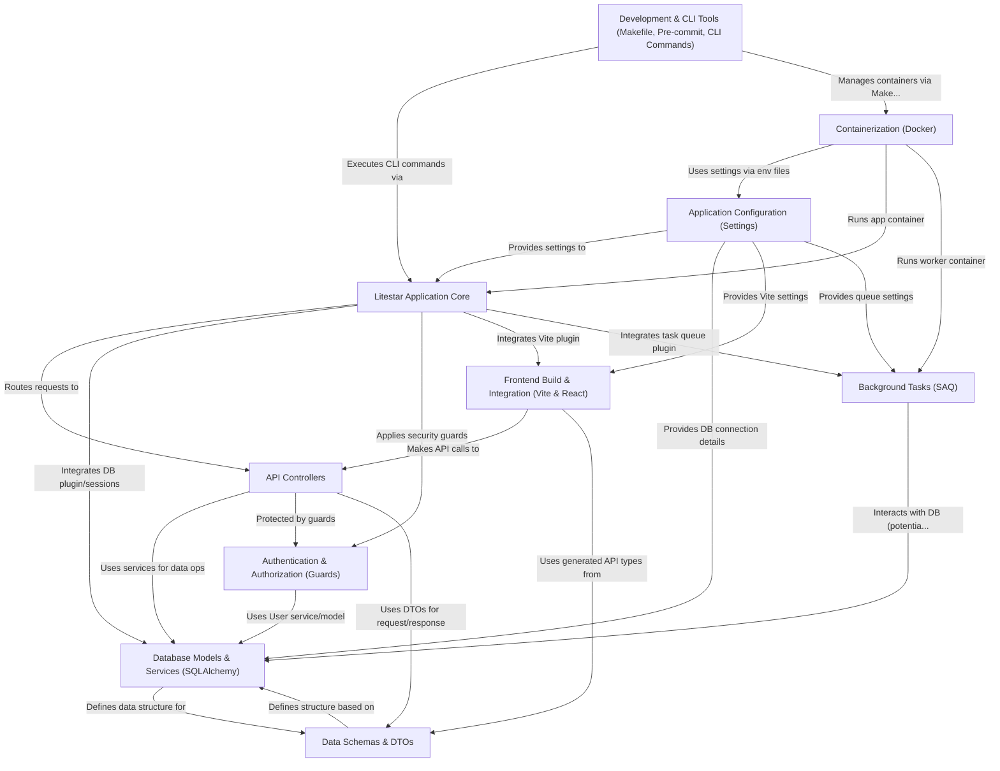

# Tutorial: litestar-fullstack

This project is a **fullstack web application** template built using the *Litestar* framework for the Python backend and *React* with *Vite* for the frontend.
It provides a structured foundation including **user authentication**, team management, database interactions (using SQLAlchemy), background task processing, and containerization with Docker.
Think of it as a ready-to-use starting point for building modern web applications, complete with essential features and development tools.

**Source Repository:** [litestar-fullstack](https://github.com/litestar-org/litestar-fullstack/commit/6859548b873caba5ab8b285290dfba0a90dd8bea)

---

Generated by [AI Codebase Knowledge Builder](https://github.com/The-Pocket/Tutorial-Codebase-Knowledge)
